# MessagingAndroidSDK

[](https://git.messangi.com/messangi/messangi-ios-sdk)

[](https://git.messangi.com/messangi/messangi-ios-sdk)


## Description
---
It is a tool that allows you to add the following functionalities to your solution
- Send notifications through messangi services.
- Enable or disable notifications by the user.
- Register device characteristics (UUID, Type, Language, OS Version, Model).
- Associate labels to the device.
- Save customizable user information.
- Set up for Geofence monitoring.
- Receive push notification and add Geofence.
- Receive push notification and update Geofence.
- Receive push notification and delete Geofence.
- Create Geofence Object builder.
- Specfy Geofence and initial triggers.
- Use a boadcast receiver for Geofence Transition.
- Sort the geofences based on the last location obtained and record up to 100 geofences.
- Handle geofence transitions.
- Stop geofence Monitoring.
- Reduction power consumption.
- Re-register geofences only when required.
- Handle InAppPush and Silent Push.

## Requirements
---
To use the Messangi SDK is required:
- A registered apple account in the development program.
- Follow the next steps for installation.

## Installation
----
### Step 1: Create Android Studio Project
Open Android Studio IDE and start new project you are working on.
#### Implicit Implementation
Place the "MessagiSDK" dependency in app.gradle
```Gradle 
implementation 'com.android.testdefsdknotificactionpush:sdk:1.0'
```
or
The SDK folder can only be obtained from this repo, put folder new project project directory and put this line in app.gradle:
```Gradle 
 implementation project(path: ':sdk')
```
and in settings.gradle:
```Gradle 
 include ':app', ':sdk'
```
### 2) Configure FCM in Android Project Project
Select your project and go to the **Tools** tab, select a Firebase and open the assistant then:
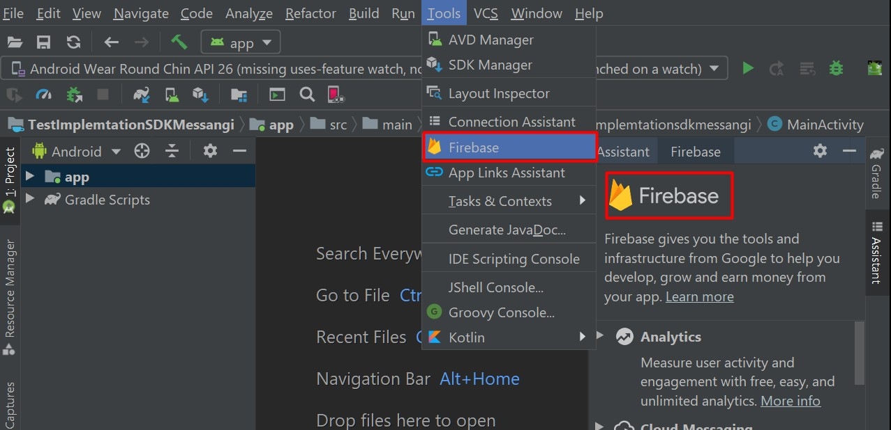

1.- Select Cloud Messangin and Set up Firebase Cloud Messanging.
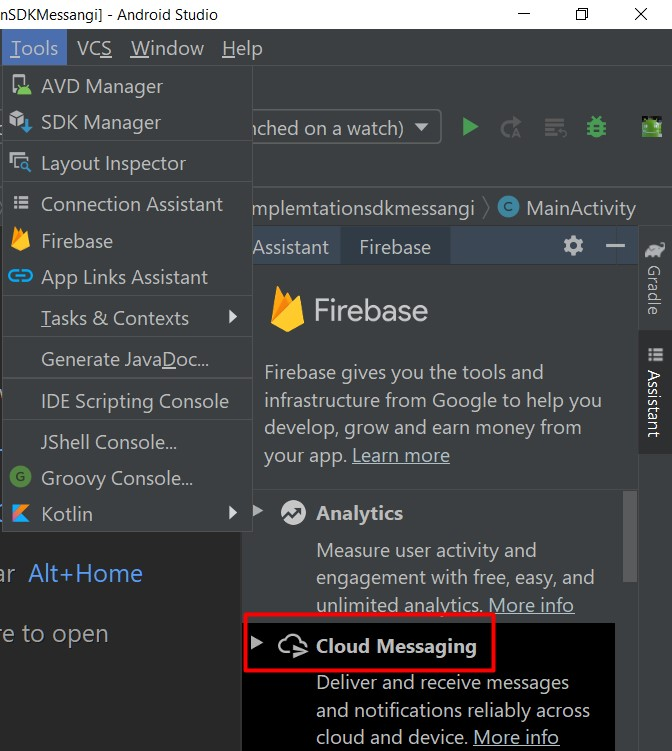
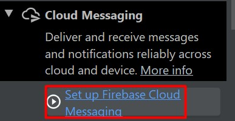

2.- Connect app to Firebase and create new or select Firebase project in console.
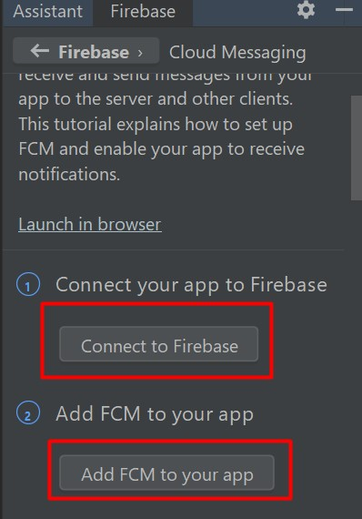
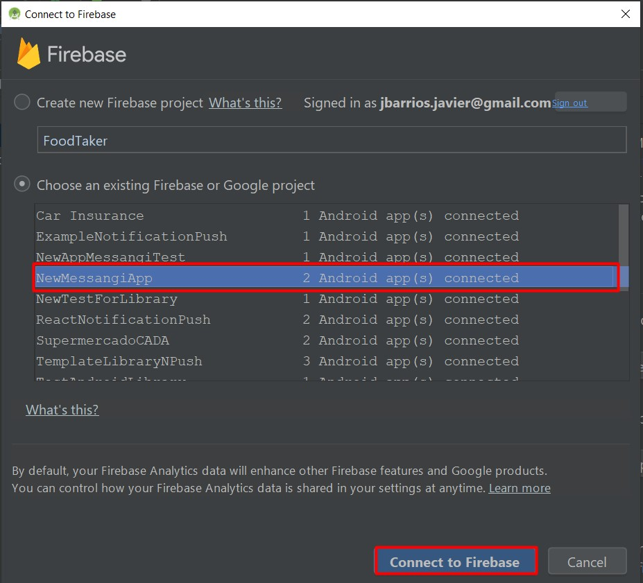
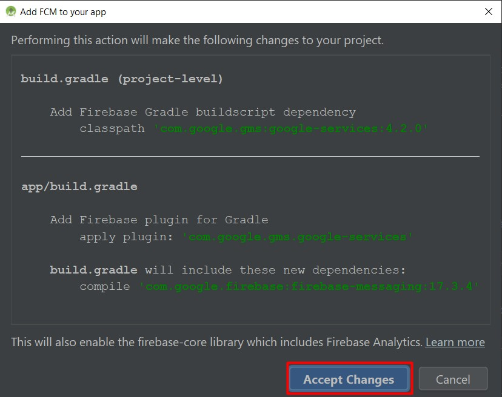
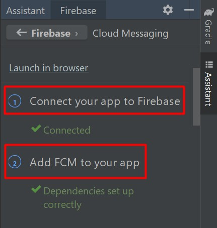

3.- Do not perform step 3 "Handle message", as the SDK will do it for you.

### 3) Put Messangi.xlm file in values project.
Put the configuration file in the values folder of the Android project

```xml
<resources>
  <string name="messangi_host" translatable="false" templateMergeStrategy="preserve"><"Url services"></string>
  <string name="messangi_app_token" translatable="false"><"Auth token"></string>
  <bool name="analytics_allowed">boolean condition</bool>
  <bool name="location_allowed">boolean condition</bool>
  <bool name="logging_allowed">boolean condition</bool>
  <bool name="locationPermissionAtStartup">boolean condition</bool>
</resources>
```
### 4) Put LocalBroadcastReceiver in Activity project.
Put LocalBroadcastReceiver in Activity file project, example:

```java
...
import com.ogangi.messangi.sdk.Messangi;

public class MainActivity extends AppCompatActivity{
    ...
       ...
        @Override
    protected void onStart() {
        super.onStart();
        LocalBroadcastManager.getInstance(this).registerReceiver(mReceiver,
                new IntentFilter(Messaging.ACTION_FETCH_DEVICE));
                .....
    }
    
```
The Receiver of the LocalBroadcastManager instances must be registered using the corresponding Intentfilte, example: Messaging.ACTION_FETCH_DEVICE 
```
    
    public void dothisForRequestUser() {
        Messaging.fetchDevice(false);
    }
    
```
Using fetchDevice device delivers the instance of a device, by internal memory, by local memory or a service.


     @Override
    protected void onDestroy() {
       LocalBroadcastManager.getInstance(this).unregisterReceiver(mReceiver);
        super.onDestroy();
    }
Unregister Receiver in main Activity.

If you want to get a response from the fetch device request you should implement a LocalBroadcastReceiver in the main Activity:
 
```java
private BroadcastReceiver mReceiver=new BroadcastReceiver() {
        @Override
        public void onReceive(Context context, Intent intent) {
            boolean hasError=intent.getBooleanExtra(Messaging.INTENT_EXTRA_HAS_ERROR,true);
            
            if (!hasError ) {
                Serializable data=intent.getSerializableExtra(Messaging.INTENT_EXTRA_DATA);
                switch (intent.getAction()){
                    case Messaging.ACTION_REGISTER_DEVICE:
                        messagingDevice = (MessagingDevice) data;
                       ...
                    break;
                    case Messaging.ACTION_FETCH_DEVICE:
                        messagingDevice = (MessagingDevice) data;
                        //or messagingDevice = MessagingDevice.getInstance();
                        ....
                        if(messagingUser == null){
                            Messaging.fetchUser(getApplicationContext(),false);
                        }
                        ....
                    break;
                    case Messaging.ACTION_SAVE_DEVICE:
                        messagingDevice = (MessagingDevice) data;
                        ....
                        if(messagingUser != null){
                            Messaging.fetchUser(getApplicationContext(),true);
                        }
                        ......
                        break;

                    case Messaging.ACTION_FETCH_USER:
                        messagingUser = (MessagingUser) data;
                        //or messagingUser = MessagingUser.getInstance();
                        .....
                        break;
                    case Messaging.ACTION_SAVE_USER:
                        messagingUser = (MessagingUser) data;
                        .....
                        break;
                    case Messaging.ACTION_GET_NOTIFICATION:
                        messagingNotification = (MessagingNotification) data;
                        ....
                        break;
                    case Messaging.ACTION_GET_NOTIFICATION_OPENED:
                        messagingNotification = (MessagingNotification) data;
                        ...
                        break;
                    case Messaging.ACTION_FETCH_LOCATION:
                    MessagingLocation messagingLocation = (MessagingLocation) data;
                        .....
                        break;
                    default:
                        break;
                }
            }else{
                Toast.makeText(getApplicationContext(),"An error occurred on action "
                        +intent.getAction(),Toast.LENGTH_LONG).show();
            }
            ......
        }
    };
   //you can observe all the implementation in example app
```
### 5) Put BroadcastReceiver in app project.
Put BroadcastReceiver in app project, example:

```java
...
import com.ogangi.messangi.sdk.Messangi;

public class MessagingNotificationReceiver extends BroadcastReceiver{
    ...
      ...
        @Override
    public void onReceive(Context context, Intent intent) {
       boolean hasError=intent.getBooleanExtra(Messaging.INTENT_EXTRA_HAS_ERROR,true);
        
        if (!hasError ) {
            String action=intent.getAction();
            Serializable data = intent.getSerializableExtra(Messaging.INTENT_EXTRA_DATA);
            //optional code to determinate if app is Background or not
            ActivityManager.RunningAppProcessInfo myProcess = new ActivityManager.RunningAppProcessInfo();
            ActivityManager.getMyMemoryState(myProcess);
            boolean isInBackground = myProcess.importance != ActivityManager.RunningAppProcessInfo.IMPORTANCE_FOREGROUND;
            
            if(intent.getAction().equals(Messaging.ACTION_GET_NOTIFICATION)&& data!=null){
            ........
            }else if(intent.getAction().equals(Messaging.ACTION_FETCH_LOCATION)){
                wayLatitude = intent.getDoubleExtra(Messaging.INTENT_EXTRA_DATA_lAT,0.00);
                 wayLongitude = intent.getDoubleExtra(Messaging.INTENT_EXTRA_DATA_lONG,0.00);
                 Location location=new Location(LOCATION_SERVICE);
                 location.setLatitude(wayLatitude);
                 location.setLongitude(wayLongitude);
                 MessagingLocation messagingLocation=new MessagingLocation(location);
                 if(isInBackground){
                    .......
                 }else{
                     sendEventToActivity(Messaging.ACTION_FETCH_LOCATION,messagingLocation,context);
                     .......
                 }
            }else if(intent.getAction().equals(Messaging.ACTION_GEOFENCE_ENTER)
                     ||intent.getAction().equals(Messaging.ACTION_GEOFENCE_EXIT)
                     ||intent.getAction().equals(Messaging.ACTION_FETCH_GEOFENCE)){
                        if(isInBackground){
                        ..... 
                        }else{
                         sendEventToActivity(Messaging.ACTION_FETCH_GEOFENCE,messagingCircularRegions,context);
                         }
                         
            }
        }
        .....
    }
    //to Handle InAppPush, SIlent Push and Geopush
    private void handleDataNotification(Serializable data, Intent intent,
                                        Context context, String action, boolean isInBackground) {
        if(isInBackground){
            messagingNotification = (MessagingNotification) data;
            String subject="";
            String content = "";
            String Title="";
            String Text = "";
            String Image="";
            boolean showCustomNotification=false;
            boolean showCustomNotificationGeoPush=false;
            for (Map.Entry entry : messagingNotification.getAdditionalData().entrySet()) {
                if(!entry.getKey().equals("profile")){
                    if(entry.getKey().equals("subject")) {
                        subject= (String) entry.getValue();
                    }else if(entry.getKey().equals("content")){
                        content= (String) entry.getValue();
                    }else if(entry.getKey().equals("Title")){
                        Title= (String) entry.getValue();
                    }else if(entry.getKey().equals("Text")){
                        Text= (String) entry.getValue();
                    }else if(entry.getKey().equals("Image")){
                        Image= (String) entry.getValue();
                        showCustomNotification=true;
                    }else if(entry.getKey().equals("MSGI_GEOPUSH")){
                        showCustomNotificationGeoPush=true;
                    }
                }
            }
            if(showCustomNotification){
                showCustomNotification(Title,Text,Image,context,messagingNotification);
            }
            if(showCustomNotificationGeoPush){
                showNotificationGP(messagingNotification,context);
            }

        }else{
            sendEventToActivity(action,data,context);
        }
    }
    //to Handle SIlent Push with image and data
    private void showCustomNotification(String title, String text, String image, 
                                        Context context, MessagingNotification messagingNotification) {
        nameMethod="showCustomNotification";
        new Thread(new Runnable() {
            @Override
            public void run() {
                URL url = null;
                try {
                    url = new URL(image);
                    Bitmap bmp = BitmapFactory.decodeStream(url.openConnection().getInputStream());
                    Intent notificationIntent=null;
                    try {
                    notificationIntent = new Intent(context,
                                Class.forName(messaging.getNameClass()));
                        if(messagingNotification.getAdditionalData().size()>0) {
                            notificationIntent.putExtra(Messaging.INTENT_EXTRA_DATA, messagingNotification);
                            Static.messagingNotification=messagingNotification;
                        }
                    } catch (ClassNotFoundException e) {
                        e.printStackTrace();
                       ....
                    }catch (NullPointerException e){
                        e.printStackTrace();
                        notificationIntent = new Intent("android.intent.action.MAIN");
                    }
                    notificationIntent.addFlags(Intent.FLAG_ACTIVITY_CLEAR_TOP);
                    final PendingIntent pendingIntent = PendingIntent.getActivity(context
                            , 0, notificationIntent,
                            PendingIntent.FLAG_ONE_SHOT);
                    notificationManager =
                            (NotificationManager) context.getSystemService(Context.NOTIFICATION_SERVICE);
                    Notification notification = new NotificationCompat.Builder(context, CHANNEL_ID)
                            .setSmallIcon(R.mipmap.ic_launcher)
                            .setContentTitle(title)
                            .setContentText(text)
                            .setLargeIcon(bmp)
                            .setContentIntent(pendingIntent)
                            .setAutoCancel(true)
                            .setNotificationSilent()
                            .setStyle(new NotificationCompat.BigPictureStyle()
                                    .bigPicture(bmp)
                                    .bigLargeIcon(null))
                            .build();

                notificationManager.notify(1 /* ID of notification */, notification);
                    
                } catch (MalformedURLException e) {
                    e.printStackTrace();
                    ....
                } catch (IOException e) {
                    e.printStackTrace();
                    .....
                }
            }
        }).start();
    }
    
    //to handle Geopush in Background
    private void showNotificationGP(MessagingNotification notification, Context context) {
        String classNameProv=messaging.getNameClass();
        Intent notificationIntent=null;
        String Title="";
        String Body="";
        Title=notification.getTitle();
        Body=notification.getBody();
        try {
            notificationIntent = new Intent(context, Class.forName(classNameProv));
            if(messagingNotification.getAdditionalData().size()>0) {
                notificationIntent.putExtra(Messaging.INTENT_EXTRA_DATA, messagingNotification);
                Static.messagingNotification=messagingNotification;
            }

        } catch (ClassNotFoundException e) {
            e.printStackTrace();

        }catch (NullPointerException e){
            e.printStackTrace();
            notificationIntent = new Intent("android.intent.action.MAIN");
        }

        notificationIntent.addFlags(Intent.FLAG_ACTIVITY_CLEAR_TOP);
        final PendingIntent pendingIntent = PendingIntent.getActivity(context, 0, notificationIntent,
                PendingIntent.FLAG_ONE_SHOT);
        notificationManager = (NotificationManager) context.getSystemService(Context.NOTIFICATION_SERVICE);

        //Setting notification for Android Oreo or higer.
        if (android.os.Build.VERSION.SDK_INT >= android.os.Build.VERSION_CODES.O) {
            setupChannels(context);
        }
        int notificationId = new Random().nextInt(60000);

        // Create the notification.
        Uri defaultSoundUri = RingtoneManager.getDefaultUri(RingtoneManager.TYPE_NOTIFICATION);
        NotificationCompat.Builder notificationBuilder = new NotificationCompat.Builder(context, ADMIN_CHANNEL_ID)
                .setSmallIcon(messaging.icon)  //a resource for your custom small icon
                .setContentTitle(Title) //the "title" value you sent in your notification
                .setContentText(Body) //ditto
                .setAutoCancel(true)  //dismisses the notification on click
                .setContentIntent(pendingIntent)
                .setSound(defaultSoundUri);

        NotificationManager notificationManager =
                (NotificationManager) context.getSystemService(Context.NOTIFICATION_SERVICE);
        notificationManager.notify(notificationId /* ID of notification */, notificationBuilder.build());

    }

    @RequiresApi(api = Build.VERSION_CODES.O)
    private void setupChannels(Context context) {
        CharSequence adminChannelName = context.getString(com.messaging.sdk.R.string.notifications_admin_channel_name);
        String adminChannelDescription = context.getString(com.messaging.sdk.R.string.notifications_admin_channel_description);
        NotificationChannel adminChannel;
        adminChannel = new NotificationChannel(ADMIN_CHANNEL_ID, adminChannelName, NotificationManager.IMPORTANCE_LOW);
        adminChannel.setDescription(adminChannelDescription);
        adminChannel.enableLights(true);
        adminChannel.setLightColor(Color.RED);
        adminChannel.enableVibration(true);
        if (notificationManager != null) {
            notificationManager.createNotificationChannel(adminChannel);
        }
    }
    
   /**
     * Method that send Parameter (Ej: messagingDevice or MessagingUser) registered to Activity
     * @param something : Object Serializable for send to activity (Ej messagingDevice).
     * @param context : context instance
     */
    private void sendEventToActivity(String action,Serializable something, Context context) {
        if(something!=null) {
            Intent intent = new Intent(action);
            intent.putExtra(Messaging.INTENT_EXTRA_DATA, something);
            intent.putExtra(Messaging.INTENT_EXTRA_HAS_ERROR, something == null);
            LocalBroadcastManager.getInstance(context).sendBroadcast(intent);
        }else{
            .... 
        }
    }
```
Please declare BroadcastReceivers in Manifest.xml of app project, example:

```xml
<?xml version="1.0" encoding="utf-8"?>
<manifest xmlns:android="http://schemas.android.com/apk/res/android"
    xmlns:tools="http://schemas.android.com/tools"
    package="com.ogangi.Messangi.SDK.Demo">

    <application
        .....
        <activity 
        </activity>
        <receiver
            android:name=".MessagingNotificationReceiver"
            android:enabled="true"
            android:permission="${applicationId}.permission.pushReceive"
            android:exported="false"
            tools:ignore="Instantiatable">
            <intent-filter>
               <action android:name="com.messaging.sdk.PUSH_NOTIFICATION"/>
               <action android:name="com.messaging.sdk.ACTION_FETCH_LOCATION"/>
               <action android:name="com.messaging.sdk.ACTION_GEOFENCE_ENTER"/>
               <action android:name="com.messaging.sdk.ACTION_GEOFENCE_EXIT"/>
            </intent-filter>
        </receiver>
        <receiver
            android:name="com.messaging.sdk.MessaginGeofenceBroadcastReceiver"
            android:enabled="true"
            android:exported="true">
            <intent-filter>
                <action android:name="android.intent.action.BOOT_COMPLETED" />
                <category android:name="android.intent.category.DEFAULT" />
            </intent-filter>
        </receiver>
    </application>
    <permission
        android:name="${applicationId}.permission.pushReceive"
        android:protectionLevel="signature" />
    <uses-permission android:name="${applicationId}.permission.pushReceive" />
</manifest>
```

## Usage
To make use of the functionalities that Messanging SDK offers, the Messaging class is available, to obtain the instance of this class you can do: 
```java
Messaging messaging=Messaging.getInstance(this);//get Instance of Messaging..
//or Messaging messaging=Messaging.getInstance();//get Instance of Messaging..
```
All the services offered by this library are provided by means of an instance of the Messaging class, and it can be obtained that it was indicated later.
```java
MessagingDevice messagingDevice; 
```
MessangingDevice is used for handle Device paramenter in SDK. To obtain this device instance, the SDK can provide it in three ways: by local memory, internal memory or by service. all forms use a BroadcastReceiver to get that instance. see point number 4
```java
MessagingUser messagingUser; 
```

MessagingUser is used for handle User paramenter in SDK.
To obtain this User instance, the SDK can provide it in three ways: by local memory, internal memory or by service. all forms use a BroadcastReceiver to get that instance. see point number 4

By doing this you have access to
    Method that get Device registered
    forsecallservice: It allows effective device search in three ways: by instance,
     by shared variable or by service. when forsecallservice=true, search device parameters through the service. This method use BoradcastReceiver for send Instance from SDK to Activity.See point number 4

```java
    Messaging.fetchDevice(true);
```
Method for add new Tags to Device, then you can do save and immediately it is updated in the database.

```java
     messagingDev.addTagToDevice(tags);
```
Method that make Update of paramenter Device using service, this method use BoradcastReceiver for send Instance from SDK to Activity.See point number 4.
```java
     messagingDevice.save(getApplicationContext());
```
Method to set status of Notification push receiver (true o false), this method is used to enable Notification push listening.
```java
     messagingDevice.setStatusNotificationPush(false, getApplicationContext());
```
Method for get User by Device registered from service, allows effective device search in three ways: by instance, by shared variable or by service. this method use BoradcastReceiver for send Instance from SDK to Activity.See point number 4.
When forsecallservice=true, search device parameters through the service.
```java
     Messaging.fetchUser(getApplicationContext(), true);
```
Method that make Update of User parameter using service, this method use BoradcastReceiver for send Instance from SDK to Activity.See point number 4.

```java
     messagingUser.save(getApplicationContext());
```
Method for add Property to user, example: name, lastname, email or phone,  key : example name
     value : example Jose, then you can use messagingUser.save(getApplicationContext());
     for update User data.
     
```java
     messagingUser.addProperty(key, value);
```
Method for ask if auntomatic permission is enable, use for get permission of location from app is instaled.
     
```java
     messaging.isEnable_permission_automatic();
```
Method for make request permission of location from app. 
```java
     Messaging.requestPermissions(AnyActivity.this);
```
Method for set state of GPS in SDK. 
```java
     messaging.setGPS(isGPSEnable);
```
Method to logOut process, deleting dB local of Geofence and disable listening of Notification push. 
```java
     Messaging.logOutProcess();
```
Method to set Location Allowed in sdk (true or false). 
```java
     Messaging.setLocationAllowed(isChecked);
```
Method to set Analytic Allowed in sdk (true or false). 
```java
    Messaging.setAnalytincAllowed(isChecked);
```
Method to set Loging Allowed in sdk (true or false). 
```java
    Messaging.setLogingAllowed(isChecked);
```
Method to get Location Allowed state (true or false). 
```java
    messaging.isLocation_allowed();
```
Method to get Loging Allowed state (true or false). 
```java
    messaging.isLogging_allowed();
```
Method to get Analytics Allowed state (true or false). 
```java
    messaging.isAnalytics_allowed();
```
Method to set Location Continue Allowed state (true or false). 
```java
    Messaging.setLocationContinueAllowed(isChecked);
```
Method to fetch Location contunue mode (true parameter) 
```java
    Messaging.fetchLocation(AnyActivity.this, true);
```
Method to remove Location Updates continue or one shot. 
```java
   Messaging.turnOFFUpdateLocation();
```
Method to enable Location Updates in Background mode. 
```java
   Messaging.enableLocationBackground=true or false;
```
Method to set Location Backgroun Allowed state (true or false). 
```java
    Messaging.setLocationBackgroundAllowed(isChecked);
```
Method to know if has Location Continue Allowed 
```java
    Messaging.hasLocationContinueAllowed();
```
Method to get Location Continue Allowed state
```java
    Messaging.getLocationContinueAllowed();
```
Method to know if has Location Background Allowed 
```java
    Messaging.hasLocationBackgroundAllowed();
```
Method to get Location Background Allowed state
```java
    Messaging.getLocationBackgroundAllowed();
```
Method to fetch Geofences from service or local base data
```java
    Messaging.fetchGeofence(); //from base data
    or Messaging.fetchGeofence(true); //from service
```
Method to get enable permission automatic state
```java
    messaging.isEnable_permission_automatic();
```

Method to request location from app.
```java
    Messaging.requestPermissions(AnyActivity.this);
```
Method to get location allowed state.
```java
    messaging.isLocation_allowed();
```
Method to get logging allowed state.
```java
    messaging.isLogging_allowed();
```
Method to get Analytics allowed state.
```java
    messaging.isAnalytics_allowed();
```
Method to check GPlay Service Status.
```java
   Messaging.checkGPlayServiceStatus();
```
Method to send Event Custom from app to backend.
```java
   Messaging.sendEventCustom(key,value);
```
Method to get last location saved from storage.
```java
   Messaging.getLastLocation();
```
Method to set Location Request With Priority.
```java
   Messaging.setLocationRequestWithPriority(PRIORITY_BALANCED_POWER_ACCURACY);
   or Messaging.setLocationRequestWithPriority(PRIORITY_HIGH_ACCURACY);
   or Messaging.setLocationRequestWithPriority(PRIORITY_LOW_POWER); 
   or Messaging.setLocationRequestWithPriority(PRIORITY_NO_POWER);
```
Method to set Location Request Selected.
```java
    Messaging.setLocationProritySelected(which);
```
Method to stop Geofences Supervition.
```java
    Messaging.stopGeofencesSupervition();
```

## Example - Getting MessagingDevice
```java
...
import com.ogangi.messangi.sdk.Messangi;

public class MainActivity extends AppCompatActivity{
    ...
    @Override
    protected void onCreate(Bundle savedInstanceState) {
    super.onCreate(savedInstanceState);
        
    }
      @Override
    protected void onStart() {
        super.onStart();
       LocalBroadcastManager.getInstance(this).registerReceiver(mReceiver,
                new IntentFilter(Messaging.ACTION_FETCH_DEVICE));
      }
       ...
      @Override
    protected void onResume() {
        super.onResume();
       Messaging.fetchDevice(false);
    }
    private BroadcastReceiver mReceiver=new BroadcastReceiver() {
        @Override
        public void onReceive(Context context, Intent intent) {
            boolean hasError=intent.getBooleanExtra(Messaging.INTENT_EXTRA_HAS_ERROR,true);
            
            if (!hasError ) {
                Serializable data=intent.getSerializableExtra(Messaging.INTENT_EXTRA_DATA);
                if(intent.getAction().equals(Messaging.ACTION_FETCH_DEVICE)&& data!=null){
                    messagingDevice = (MessagingDevice) data; //you can cast this for get information
                    .....
                }else if(intent.getAction().equals(Messaging.ACTION_FETCH_USER)&& data!=null){
                    messagingUser =(MessagingUser) data;
                    .......
                
            }else{
                Toast.makeText(getApplicationContext(),"An error occurred on action "
                        +intent.getAction(),Toast.LENGTH_LONG).show();
            }
            ......
        }
    };
   //you can see all the implementation in example app
     @Override
    protected void onDestroy() {
     LocalBroadcastManager.getInstance(this).unregisterReceiver(mReceiver);
     }
   ```

## Example - Getting MessagingUser
```java
...
import com.ogangi.messangi.sdk.MessangiUserDevice;

public class MainActivity extends AppCompatActivity{
    private MessagingUser messagingUser;
    @Override
    protected void onCreate(Bundle savedInstanceState) {
    super.onCreate(savedInstanceState);
    }
    
       @Override
    protected void onStart() {
        super.onStart();
        LocalBroadcastManager.getInstance(this).registerReceiver(mReceiver,
                new IntentFilter(Messaging.ACTION_FETCH_USER));
        }
    ...
      
    protected void onGetUser() {
        Messaging.fetchUser(getApplicationContext(), true);
    }
    private BroadcastReceiver mReceiver=new BroadcastReceiver() {
        @Override
        public void onReceive(Context context, Intent intent) {
            boolean hasError=intent.getBooleanExtra(Messaging.INTENT_EXTRA_HAS_ERROR,true);
            
            if (!hasError ) {
                Serializable data=intent.getSerializableExtra(Messaging.INTENT_EXTRA_DATA);
                     .....
                }else if(intent.getAction().equals(Messaging.ACTION_FETCH_USER)&& data!=null){
                    messagingUser =(MessagingUser) data;
                    //or
                    messagingUser = MessagingUser.getInstance();
                    .......
                
            }else{
                Toast.makeText(getApplicationContext(),"An error occurred on action "
                        +intent.getAction(),Toast.LENGTH_LONG).show();
            }
            ......
        }
    };
   //you can see all the implementation in example app
     @Override
    protected void onDestroy() {
     LocalBroadcastManager.getInstance(this).unregisterReceiver(mReceiver);
     }
   
```
## Full implementation example:
 To MainActivity.java
```java
package com.ogangi.Messangi.SDK.Demo;
....
import androidx.annotation.RequiresApi;
import androidx.appcompat.app.AppCompatActivity;
import androidx.localbroadcastmanager.content.LocalBroadcastManager;

import com.messaging.sdk.Messaging;
import com.messaging.sdk.MessangingDevice;
import com.messaging.sdk.MessagingNotification;
import com.messaging.sdk.MessagingUser;

....

public class MainActivity extends AppCompatActivity {
    public static String CLASS_TAG=MainActivity.class.getSimpleName();
    public static String TAG="MESSANGING";
    public static final String DELETE_TAG = "DELETE_TAG";

    public Messaging messaging;
    public MessagingDevice messangingDevice;
    public MessagingUser messagingUser;
    MessagingNotification messagingNotification;
    

    @RequiresApi(api = Build.VERSION_CODES.JELLY_BEAN_MR2)
    @Override
    protected void onCreate(Bundle savedInstanceState) {
        super.onCreate(savedInstanceState);
        getWindow().requestFeature(Window.FEATURE_ACTION_BAR);

        getSupportActionBar().hide();
        setContentView(R.layout.activity_main);
        messaging = Messaging.getInstance(this);
        messaging.getExternalId());// get external ID using Sdk.

        bottomNavigation.setOnNavigationItemSelectedListener(new BottomNavigationView.OnNavigationItemSelectedListener() {
            @Override
            public boolean onNavigationItemSelected(@NonNull MenuItem item) {
                int id = item.getItemId();
                switch (id){
                    case R.id.action_add_info:
                        createAlertUser();
                        return true;
                    case R.id.action_refresh:
                        Messaging.fetchDevice(true, getApplicationContext());
                        Messaging.fetchUser(getApplicationContext(), true);
                        ......
                        return true;
                }

                return false;
            }
        });

        //for handle notification from background
    Bundle extras = null;
        if(Static.extras!=null){
        extras=Static.extras;
        Static.extras=null;
        }else{
            extras=getIntent().getExtras();
            
        }
        if(extras!=null){
            isBackground=extras.getBoolean("isInBackground",false);
            
            if(isBackground) {
                Serializable data = extras.getSerializable(Messaging.INTENT_EXTRA_DATA);
                messagingNotification=(MessagingNotification)data;
               ......

            }else {

                //to process notification from background mode
                MessagingNotification notification=Messaging.checkNotification(extras);
                .....
            }
        }
        if(messaging.isEnable_permission_automatic() ){
            Messaging.requestPermissions(MainActivity.this);
        }
    //status of Gps and turn on Gps automatic    
    new GpsUtils(this).turnGPSOn(new GpsUtils.onGpsListener() {
            @Override
            public void gpsStatus(boolean isGPSEnable) {
                messaging.setGPS(isGPSEnable);
               }
        });
    }
    
    @Override
    public boolean onCreateOptionsMenu(Menu menu) {
        getMenuInflater().inflate(R.menu.menu_main, menu);
        menu.findItem(R.id.action_visibility).setIcon(R.drawable.ic_baseline_visibility_24);
        return true;
    }

    @Override
    public boolean onOptionsItemSelected(MenuItem item) {
        int id = item.getItemId();

        switch (id){
            case R.id.action_visibility:
                if(messagingDevice.isEnableNotificationPush()) {
                    Toast.makeText(getApplicationContext(), "Disable Notification Push", Toast.LENGTH_LONG).show();
                    messagingDevice.setStatusNotificationPush(false, getApplicationContext());
                    progressBar.setVisibility(View.VISIBLE);
                    item.setIcon(R.drawable.ic_baseline_visibility_off_24);
                } else {
                    Toast.makeText(getApplicationContext(), "Enable Notification Push", Toast.LENGTH_LONG).show();
                    messagingDevice.setStatusNotificationPush(true, getApplicationContext());
                    progressBar.setVisibility(View.VISIBLE);
                    item.setIcon(R.drawable.ic_baseline_visibility_24);
                }
                return true;
            case R.id.action_location:
                gotoMapActivity();
                return true;
            case R.id.action_logout:
                goToLogin();
                return true;
            case R.id.action_getLog:
                showAlertGetLogCat();
                return true;
        }

        return super.onOptionsItemSelected(item);
    }

    @Override
    protected void onStart() {
        ....
        LocalBroadcastManager.getInstance(this).registerReceiver(mReceiver,
                new IntentFilter(Messaging.ACTION_FETCH_DEVICE));
        LocalBroadcastManager.getInstance(this).registerReceiver(mReceiver,
                new IntentFilter(Messaging.ACTION_FETCH_USER));
        LocalBroadcastManager.getInstance(this).registerReceiver(mReceiver,
                new IntentFilter(Messaging.ACTION_GET_NOTIFICATION));
        LocalBroadcastManager.getInstance(this).registerReceiver(mReceiver,
                new IntentFilter(Messaging.ACTION_GET_NOTIFICATION_OPENED));
        LocalBroadcastManager.getInstance(this).registerReceiver(mReceiver,
                new IntentFilter(Messaging.ACTION_SAVE_DEVICE));
        LocalBroadcastManager.getInstance(this).registerReceiver(mReceiver,
                new IntentFilter(Messaging.ACTION_REGISTER_DEVICE));
        LocalBroadcastManager.getInstance(this).registerReceiver(mReceiver,
                new IntentFilter(Messaging.ACTION_SAVE_USER));
        LocalBroadcastManager.getInstance(this).registerReceiver(mReceiver,
                new IntentFilter(Messaging.ACTION_FETCH_LOCATION));
    }

    @SuppressLint("SetTextI18n")
    @Override
    protected void onResume() {
       .....
       Messaging.fetchDevice(false);//get device parameter
       }
    
    private BroadcastReceiver mReceiver=new BroadcastReceiver() {
        @Override
        public void onReceive(Context context, Intent intent) {
            nameMethod = new Object(){}.getClass().getEnclosingMethod().getName();
            boolean hasError = intent.getBooleanExtra(Messaging.INTENT_EXTRA_HAS_ERROR,true);
           
            String alertMessage = getResources().getString(getResources().getIdentifier(intent.getAction(), "string", getPackageName()));
            if (!hasError) {
                Serializable data = intent.getSerializableExtra(Messaging.INTENT_EXTRA_DATA);
               
                if(data == null){
                    if(progressBar.isShown()){
                        progressBar.setVisibility(View.GONE);
                    }
                    return;
                }

                switch (intent.getAction()){
                    case Messaging.ACTION_REGISTER_DEVICE:
                        messagingDevice = (MessagingDevice) data;
                        ....
                    break;
                    case Messaging.ACTION_FETCH_DEVICE:
                        messagingDevice = (MessagingDevice) data;
                        
                        if(messagingUser == null){
                            Messaging.fetchUser(getApplicationContext(),false);
                        }
                        ......
                    break;
                    case Messaging.ACTION_SAVE_DEVICE:
                        messagingDevice = (MessagingDevice) data;
                        if(messagingUser != null){
                            
                            Messaging.fetchUser(getApplicationContext(),true);
                        }
                        ......
                        break;

                    case Messaging.ACTION_FETCH_USER:
                        messagingUser = (MessagingUser) data;
                        .....
                        break;
                    case Messaging.ACTION_SAVE_USER:
                        messagingUser = (MessagingUser) data;
                        .....
                        break;
                    case Messaging.ACTION_GET_NOTIFICATION:
                        messagingNotification = (MessagingNotification) data;
                        .....
                        break;
                    case Messaging.ACTION_GET_NOTIFICATION_OPENED:
                        messagingNotification = (MessagingNotification) data;
                        .......
                        break;
                    case Messaging.ACTION_FETCH_LOCATION:
                        MessagingLocation messagingLocation = (MessagingLocation) data;
                        ........
                        break;
                    default:
                        break;
                }
            } else {
            Toast.makeText(getApplicationContext(),"An error occurred on action "
                    + alertMessage,Toast.LENGTH_LONG).show();
                if(progressBar.isShown()){
                    progressBar.setVisibility(View.GONE);
                }
            }
            if(progressBar.isShown()){
                progressBar.setVisibility(View.GONE);
            }
        }
    };

    @Override
    protected void onDestroy() {
        LocalBroadcastManager.getInstance(this).unregisterReceiver(mReceiver);
        }
}
```
For handle Notification in Background you must use this code in Activity:
```java
        //for handle notification from background
        Bundle extras = null;
        if(Static.extras!=null){
        extras=Static.extras;
        Static.extras=null;
        }else{
            extras=getIntent().getExtras();
            Log.i(TAG, "INFO: " + CLASS_TAG + ": " + nameMethod + "extras: " + extras);
        }
        if(extras!=null){
            isBackground=extras.getBoolean("isInBackground",false);
            if(isBackground) {
                Serializable data = extras.getSerializable(Messaging.INTENT_EXTRA_DATA);
                messagingNotification=(MessagingNotification)data;
                .....
            }else {
                //to process notification from background mode
    MessagingNotification notification=Messaging.checkNotification(extras);
                .......
            }
        }
```
For handle request permission result you must use this code in Activity:
```java
        @SuppressLint("MissingPermission")
    @Override
    public void onRequestPermissionsResult(int requestCode, @NonNull String[] permissions, @NonNull int[] grantResults) {
        super.onRequestPermissionsResult(requestCode, permissions, grantResults);
        switch (requestCode) {
            case 1000: {
                // If request is cancelled, the result arrays are empty.
                if (grantResults.length > 0
                        && grantResults[0] == PackageManager.PERMISSION_GRANTED) {
                    Messaging.fetchLocation(MainActivity.this,true);
                } else {
                    Toast.makeText(getApplicationContext(), "Permission denied", Toast.LENGTH_SHORT).show();
                    permissionsDenied();
                }
                break;
            }
        }
    }
```
For handle GPS request status result you must use this code in Activity:
```java
     @Override
    protected void onActivityResult(int requestCode, int resultCode, Intent data) {
        super.onActivityResult(requestCode, resultCode, data);
        if (resultCode == Activity.RESULT_OK) {
            if (requestCode == Messaging.GPS_REQUEST) {
                messaging.setGPS(true);  // flag maintain before get location
                Log.d(CLASS_TAG, TAG+" is gps "+messaging.isGPS());
            }
        }else{
        messaging.setGPS(false);
        Log.d(CLASS_TAG, TAG+" Denai is gps "+messaging.isGPS());
    }
}
```
## Full implementation example:
 To MapsActivity.java
 ```java
 package com.ogangi.Messangi.SDK.Demo;

import android.annotation.SuppressLint;
import android.app.Activity;
import android.app.AlertDialog;
import android.app.Notification;
import android.app.NotificationChannel;
import android.app.NotificationManager;
import android.app.PendingIntent;
import android.content.BroadcastReceiver;
import android.content.Context;
import android.content.DialogInterface;
import android.content.Intent;
import android.content.IntentFilter;
import android.content.pm.ActivityInfo;
import android.content.pm.PackageManager;
import android.graphics.Bitmap;
import android.graphics.BitmapFactory;
import android.graphics.Color;
import android.location.Location;
import android.os.Build;
import android.os.Bundle;
import android.text.TextUtils;
import android.util.Log;
import android.view.Menu;
import android.view.MenuItem;
import android.view.View;
import android.widget.ArrayAdapter;
import android.widget.Button;
import android.widget.CompoundButton;
import android.widget.EditText;
import android.widget.ListView;
import android.widget.TextView;
import android.widget.Toast;
import android.widget.ToggleButton;
......
public class MapsActivity extends AppCompatActivity implements OnMapReadyCallback {

    public static String CLASS_TAG=MapsActivity.class.getSimpleName();
    public static String TAG="MESSAGING";
    private GoogleMap mMap;
    public Messaging messaging;
    private String nameMethod;
    private Marker locationMarker;
    MessagingNotification messagingNotification;
    ArrayList<MessagingCircularRegion> messagingCircularRegions;
    public boolean onetimeFlag=true;
    public MessagingLocation messagingLocation;
    private Button getLocation,getPermission;
    private ToggleButton turnOffLocationButton,getLocationC;
    private Circle geoFenceLimits;
    public TextView textView;
    public boolean showGofenceList=false;
    public boolean onShowDialog=true;
    private NotificationManager notificationManager;
    ......

    @Override
    protected void onCreate(Bundle savedInstanceState) {
        super.onCreate(savedInstanceState);
        setContentView(R.layout.activity_maps);
        setRequestedOrientation(ActivityInfo.SCREEN_ORIENTATION_PORTRAIT);
        Toolbar toolbar = findViewById(R.id.toolbar);
        setSupportActionBar(toolbar);
        messaging=Messaging.getInstance();
        getLocation=findViewById(R.id.button_get_location);
        getLocationC=findViewById(R.id.button_get_location_c);
        getPermission=findViewById(R.id.button_get_permission);
        turnOffLocationButton=findViewById(R.id.button_backgroundLocation);
        textView=findViewById(R.id.textView);
        // Obtain the SupportMapFragment and get notified when the map is ready to be used.
        SupportMapFragment mapFragment = (SupportMapFragment) getSupportFragmentManager()
                .findFragmentById(R.id.map);
        mapFragment.getMapAsync(this);

        getLocationC.setOnCheckedChangeListener(new CompoundButton.OnCheckedChangeListener() {
            @Override
            public void onCheckedChanged(CompoundButton buttonView, boolean isChecked) {
                if (isChecked) {
                    // The toggle is enabled
                    if (messaging.isLocation_allowed()) {
                        Toast.makeText(getApplicationContext(), "Continue Location "+isChecked,Toast.LENGTH_SHORT).show();
                        Messaging.fetchLocation(MapsActivity.this, true);
                       ....
                        //messaging.messagingStorageController.setLocationContinueAllowed(isChecked);
                        Messaging.setLocationContinueAllowed(isChecked);
                    } else {
                        //messaging.messagingStorageController.setLocationContinueAllowed(false);
                        Messaging.setLocationContinueAllowed(false);
                        .....
                    }
                } else {
                    // The toggle is disabled
                    Messaging.turnOFFUpdateLocation();
                    //messaging.messagingStorageController.setLocationContinueAllowed(isChecked);
                    Messaging.setLocationContinueAllowed(isChecked);
                   ....
                    Toast.makeText(getApplicationContext(), "Continue Location "+isChecked,Toast.LENGTH_SHORT).show();
                }
            }
        });

        turnOffLocationButton.setOnCheckedChangeListener(new CompoundButton.OnCheckedChangeListener() {
               @Override
               public void onCheckedChanged(CompoundButton buttonView, boolean isChecked) {
                   if (isChecked) {
                       // The toggle is enabled
                       Toast.makeText(getApplicationContext(),"Get Location in Background "+isChecked,Toast.LENGTH_SHORT).show();
                       ...
                       Messaging.enableLocationBackground=true;
                       Messaging.setLocationBackgroundAllowed(isChecked);
                   } else {
                       // The toggle is disabled
                       Toast.makeText(getApplicationContext(),"Get Location in Background "+isChecked,Toast.LENGTH_SHORT).show();
                       Messaging.enableLocationBackground=false;
                       Messaging.turnOFFUpdateLocation();
                       Messaging.setLocationBackgroundAllowed(isChecked);
                   }
               }
           });


        new GpsUtils(this).turnGPSOn(new GpsUtils.onGpsListener() {
            @Override
            public void gpsStatus(boolean isGPSEnable) {
                messaging.setGPS(isGPSEnable);
                
            }
        });

        if(Messaging.hasLocationContinueAllowed()){
            getLocationC.setChecked(Messaging.getLocationContinueAllowed());
        }
        if(Messaging.hasLocationBackgroundAllowed()){
            turnOffLocationButton.setChecked(Messaging.getLocationBackgroundAllowed());
        }
    }

    @Override
    public boolean onCreateOptionsMenu(Menu menu) {
        getMenuInflater().inflate(R.menu.menu_map, menu);
        //menu.findItem(R.id.action_visibility).setIcon(R.drawable.ic_baseline_visibility_24);
        return true;
    }

    @RequiresApi(api = Build.VERSION_CODES.KITKAT)
    @Override
    public boolean onOptionsItemSelected(MenuItem item) {
        int id = item.getItemId();

        switch (id){
            case R.id.action_get_geofences:
                Toast.makeText(getApplicationContext(), "Load geofence List....", Toast.LENGTH_SHORT).show();
                Messaging.fetchGeofence();
                if (geoFenceMarker != null) {
                    geoFenceMarker.remove();
                }
                if (geoFenceLimits != null ) {
                    geoFenceLimits.remove();
                }
                showGofenceList=true;
                return true;
            case R.id.action_get_geofences_service:
                Toast.makeText(getApplicationContext(), "Load geofence List....", Toast.LENGTH_SHORT).show();
                Messaging.fetchGeofence(true);
                showGofenceList=true;
                return true;
            case R.id.action_sinc:
                //gotoMapActivity();
                Messaging.fetchGeofence(true);
                showGofenceList=false;
                return true;
            case R.id.action_permission:
               if(messaging.isEnable_permission_automatic() ){
                    Messaging.requestPermissions(MapsActivity.this);
                }
                return true;
            case R.id.action_setpriority:
                showAlertGetPriority();
                return true;
            case R.id.action_getLocation:
                if(messaging.isLocation_allowed()) {
                    Messaging.fetchLocation(MapsActivity.this, false);
                    
                }else{
                   .....
                }
                return true;
            case R.id.action_sendEvent:
                String provReason="Lorem Ipsum es simplemente el texto de relleno de las imprentas y archivos de texto Lorem Ipsum ha sido el texto de relleno estándar de las industrias desde el año 1500 cuando un impresor desconocido usó una galería de textos y los mezcló de tal manera que logró hacer un libro de textos especimen No sólo sobrevivió 500 años, sino que tambien ingresó como texto de relleno en documentos electrónicos, quedando esencialmente igual al original. Fue popularizado en los 60s con la creación de las hojas \"Letraset\", las cuales contenian pasajes de Lorem Ipsum, y más recientemente con software de autoedición, como por ejemplo Aldus PageMaker, el cual incluye versiones de Lorem Ipsum.";
                //String provReason="Invalid push send";
                String key="noti push";
                createAlertCustomEvent(key,provReason);
                Messaging.checkGPlayServiceStatus();
                return true;

        }

        return super.onOptionsItemSelected(item);
    }

    private void createAlertCustomEvent(String key1, String provReason) {
        MaterialAlertDialogBuilder builder = new MaterialAlertDialogBuilder(this);
        builder.setTitle("Send Event Custom");

        // set the custom layout
        final View customLayout = getLayoutInflater().inflate(R.layout.custom_layout_user, null);
        builder.setView(customLayout);
        EditText editText_key = customLayout.findViewById(R.id.editText_key);
        editText_key.setHint("Key");
        editText_key.setText(key1);
        EditText editText_value = customLayout.findViewById(R.id.editText_value);
        editText_value.setHint("Reason");
        editText_value.setText(provReason);
        // add a button
        builder.setPositiveButton("Cancel", new DialogInterface.OnClickListener() {
            @SuppressLint("SetTextI18n")
            @Override
            public void onClick(DialogInterface dialog, int which) {
                // send data from the AlertDialog to the Activity
               dialog.dismiss();

            }
        });

        builder.setNeutralButton("Send", new DialogInterface.OnClickListener() {
            @RequiresApi(api = Build.VERSION_CODES.KITKAT)
            @Override
            public void onClick(DialogInterface dialog, int which) {
                String key = editText_key.getText().toString();
                String value = editText_value.getText().toString();
                if(!TextUtils.isEmpty(key) && !TextUtils.isEmpty(value)){
                    Messaging.sendEventCustom(key,value);
                }else{
                    createAlertCustomEvent(key,value);
                }
                dialog.cancel();

            }
        });
        // create and show the alert dialog
        // AlertDialog dialog = builder.create();
        builder.show();
    }

    @SuppressLint("SetTextI18n")
    private void showAlertGeofenceList(ArrayList<MessagingCircularRegion> geofenceFromdB) {
        // create an alert builder
        MaterialAlertDialogBuilder builder = new MaterialAlertDialogBuilder(this);
        // builder.setTitle("Notification");
        // set the custom layout
        //final View customLayout = getLayoutInflater().inflate(R.layout.custom_notification_layout, null);
        final View customLayout = getLayoutInflater().inflate(R.layout.notification_layout, null);
        builder.setView(customLayout);
        TextView title=customLayout.findViewById(R.id.textView_title_geofence_list);
        title.setText(getResources().getString(R.string.geofence_info));
        ArrayList<String> messangiGeofenceData = new ArrayList<>();
        ArrayAdapter<String> messangiDataArrayAdapter;
        ListView listView=customLayout.findViewById(R.id.list_data_noti);
        if(geofenceFromdB.size()>0) {
            messangiGeofenceData.add("# Geofence "+geofenceFromdB.size());
            if(Messaging.getLastLocation()!=null) {
                messangiGeofenceData.add("Last Location " + "\n" + "Lat: "
                        + Messaging.getLastLocation().getLatitude() + " Long: "
                        + Messaging.getLastLocation().getLongitude());
                final Location provLocation = Messaging.getLastLocation();
                for (MessagingCircularRegion region : geofenceFromdB) {
                    if(Utils.isValidLatLng(region.getLatitude(),region.getLongitud())) {
                        messangiGeofenceData.add(region.toString()+"Valid Location ✅");
                    }else {
                        messangiGeofenceData.add(region.toString()+"\n"+"Invalid Location ✖");
                    }


                    if(provLocation!=null){
                        Location location1 = new Location(LOCATION_SERVICE);
                        location1.setLatitude(region.getLatitude());
                        location1.setLongitude(region.getLongitud());
                        double dist = provLocation.distanceTo(location1);
                        messangiGeofenceData.add("Distance: "+dist);
                    }
                }
            }else{
                messangiGeofenceData.add("Hasn't Last Location " );
                for (MessagingCircularRegion region : geofenceFromdB) {
                    if(Utils.isValidLatLng(region.getLatitude(),region.getLongitud())) {
                        messangiGeofenceData.add(region.toString()+"Valid Location ✅");
                    }else {
                        messangiGeofenceData.add(region.toString()+"\n"+"Invalid Location ✖");
                    }
                    String dist = "Can't calculate";
                    messangiGeofenceData.add("Distance: " + dist);
                }
            }

        }else{
            messangiGeofenceData.add(" Do not have Geofences yet! ");
        }


        messangiDataArrayAdapter = new ArrayAdapter<>(this, R.layout.item_device, R.id.Texview_value, messangiGeofenceData);
        listView.setAdapter(messangiDataArrayAdapter);


        // add a button
        builder.setPositiveButton("Ok", new DialogInterface.OnClickListener() {
            @Override
            public void onClick(DialogInterface dialog, int which) {
                // send data from the AlertDialog to the Activity
                onetimeFlag=true;
                dialog.dismiss();
            }
        });

        builder.show();

    }


    private void showAlertGetPriority() {
        MaterialAlertDialogBuilder alertDialog = new MaterialAlertDialogBuilder(this);
        //AlertDialog.Builder alertDialog = new AlertDialog.Builder(MapsActivity.this);
        alertDialog.setTitle("SELECT PRIORITY LOCATION");
        Messaging.turnOFFUpdateLocation();
        getLocationC.setChecked(false);
        String[] items = {"PRIORITY_BALANCED_POWER_ACCURACY","PRIORITY_HIGH_ACCURACY","PRIORITY_LOW_POWER","PRIORITY_NO_POWER"};
        //int checkedItem = messaging.messagingStorageController.getLocationProritySelected();
        int checkedItem = Messaging.getLocationProritySelected();
        alertDialog.setSingleChoiceItems(items, checkedItem, new DialogInterface.OnClickListener() {
            @Override
            public void onClick(DialogInterface dialog, int which) {
                switch (which) {
                    case 0:
                        Toast.makeText(MapsActivity.this, "PRIORITY_BALANCED_POWER_ACCURACY", Toast.LENGTH_LONG).show();
                        Messaging.setLocationRequestWithPriority(PRIORITY_BALANCED_POWER_ACCURACY);
                        Messaging.setLocationProritySelected(which);
                        break;
                    case 1:
                        Toast.makeText(MapsActivity.this, "PRIORITY_HIGH_ACCURACY", Toast.LENGTH_LONG).show();
                       Messaging.setLocationRequestWithPriority(PRIORITY_HIGH_ACCURACY);
                        
                        Messaging.setLocationProritySelected(which);
                        break;
                    case 2:
                        Toast.makeText(MapsActivity.this, "PRIORITY_LOW_POWER", Toast.LENGTH_LONG).show();
                        Messaging.setLocationRequestWithPriority(PRIORITY_LOW_POWER);
                        
                        Messaging.setLocationProritySelected(which);
                        break;
                    case 3:
                        Toast.makeText(MapsActivity.this, "PRIORITY_NO_POWER", Toast.LENGTH_LONG).show();
                        Messaging.setLocationRequestWithPriority(PRIORITY_NO_POWER);
                        
                        Messaging.setLocationProritySelected(which);
                        break;

                }
            }
        });
        alertDialog.setNeutralButton("Close", new DialogInterface.OnClickListener() {
            @Override
            public void onClick(DialogInterface dialog, int which) {
                dialog.dismiss();
            }
        });
        //AlertDialog alert = alertDialog.create();
        alertDialog.setCancelable(false);
        alertDialog.show();

    }

    @Override
    protected void onStart() {
        super.onStart();
        nameMethod=new Object(){}.getClass().getEnclosingMethod().getName();
        Log.d(TAG,"DEBUG: "+CLASS_TAG+": "+nameMethod+": register LocalBroadcastReceiver");
        LocalBroadcastManager.getInstance(this).registerReceiver(mReceiver,
                new IntentFilter(Messaging.ACTION_FETCH_LOCATION));
        LocalBroadcastManager.getInstance(this).registerReceiver(mReceiver,
                new IntentFilter(Messaging.ACTION_GET_NOTIFICATION));
        LocalBroadcastManager.getInstance(this).registerReceiver(mReceiver,
                new IntentFilter(Messaging.ACTION_FETCH_GEOFENCE));
    }

    @Override
    protected void onResume() {
        super.onResume();
        Messaging.fetchGeofence();
    }

    /**
     * Manipulates the map once available.
     * This callback is triggered when the map is ready to be used.
     * This is where we can add markers or lines, add listeners or move the camera. In this case,
     * we just add a marker near Sydney, Australia.
     * If Google Play services is not installed on the device, the user will be prompted to install
     * it inside the SupportMapFragment. This method will only be triggered once the user has
     * installed Google Play services and returned to the app.
     */
    @Override
    public void onMapReady(GoogleMap googleMap) {
        mMap = googleMap;

        // Add a marker in Sydney and move the camera
//        LatLng sydney = new LatLng(-34, 151);
//        mMap.addMarker(new MarkerOptions().position(sydney).title("Marker in Sydney"));
//        mMap.moveCamera(CameraUpdateFactory.newLatLng(sydney));
    }

    private void writeActualLocation(Location location) {
        markerLocation(new LatLng(location.getLatitude(),location.getLongitude()));
    }

    private void markerLocation(LatLng latLng) {
        Log.i(CLASS_TAG, "markerLocation("+latLng+")");
        String title = latLng.latitude + ", " + latLng.longitude;
        MarkerOptions markerOptions = new MarkerOptions()
                .position(latLng)
                .title(title);
        if ( mMap!=null ) {
            // Remove the anterior marker
            if ( locationMarker != null )
                locationMarker.remove();
            locationMarker = mMap.addMarker(markerOptions);
            float zoom = 15f;
            CameraUpdate cameraUpdate = CameraUpdateFactory.newLatLngZoom(latLng, zoom);

            mMap.animateCamera(cameraUpdate);
            mMap.moveCamera(cameraUpdate);
            mMap.setMapType(GoogleMap.MAP_TYPE_HYBRID);
        }

    }

    @Override
    protected void onDestroy() {
        nameMethod=new Object(){}.getClass().getEnclosingMethod().getName();
       LocalBroadcastManager.getInstance(this).unregisterReceiver(mReceiver);
        super.onDestroy();
    }

    private Marker geoFenceMarker;
    // Create a marker for the geofence creation
    private void markerForGeofence(LatLng latLng, int radius, int monitoring, int size, String id) {
        Log.i(CLASS_TAG, "markerForGeofence("+latLng+")"+size);

        // Define marker options
        MarkerOptions markerOptions;
        if(monitoring==1) {
             String title = id+" "+latLng.latitude + ", " + latLng.longitude+"  "+"ON "+" "+radius;
             markerOptions= new MarkerOptions()
                    .position(latLng)
                    .icon(BitmapDescriptorFactory.defaultMarker(BitmapDescriptorFactory.HUE_GREEN))
                    .title(title);
        }else{
             String title = id+" "+latLng.latitude + ", " + latLng.longitude+"  "+"OFF "+" "+radius;
             markerOptions = new MarkerOptions()
                    .position(latLng)
                    .icon(BitmapDescriptorFactory.defaultMarker(BitmapDescriptorFactory.HUE_ROSE))
                    .title(title);
        }
        if ( mMap!=null ) {
            // Remove last geoFenceMarker
            if (geoFenceMarker != null) {
               // geoFenceMarker.remove();
            }
            geoFenceMarker = mMap.addMarker(markerOptions);
            drawGeofence(radius);
        }

    }

    private void drawGeofence(int radius) {
        
        if ( geoFenceLimits != null ) {
            //geoFenceLimits.remove();
        }

        CircleOptions circleOptions = new CircleOptions()
                .center( geoFenceMarker.getPosition())
                .strokeColor(Color.argb(50, 70,70,70))
                .fillColor( Color.argb(100, 150,150,150) )
                .radius( radius );
        geoFenceLimits = mMap.addCircle( circleOptions );
    }

    private BroadcastReceiver mReceiver=new BroadcastReceiver() {
        @Override
        public void onReceive(Context context, Intent intent) {
            nameMethod=new Object(){}.getClass().getEnclosingMethod().getName();

            boolean hasError=intent.getBooleanExtra(Messaging.INTENT_EXTRA_HAS_ERROR,true);
            String alertMessage = getResources().getString(getResources().getIdentifier(intent.getAction(), "string", getPackageName()));
            Toast.makeText(getApplicationContext(), alertMessage, Toast.LENGTH_LONG).show();
            
            
            if (!hasError ) {
                Serializable data=intent.getSerializableExtra(Messaging.INTENT_EXTRA_DATA);

                if(intent.getAction().equals(Messaging.ACTION_FETCH_LOCATION) ) {

                    if(Messaging.getLastLocation()!=null) {
                        messagingLocation = new MessagingLocation(Messaging.getLastLocation());
                       ....
                    }else{
                        messagingLocation = (MessagingLocation) data;
                        .....
                    }
                    writeActualLocation(messagingLocation.getLocation());
                    }else if(((intent.getAction().equals(Messaging.ACTION_GET_NOTIFICATION))||
                            (intent.getAction().equals(Messaging.ACTION_GET_NOTIFICATION_OPENED)))&& data!=null) {
                        messagingNotification = (MessagingNotification) data;
                        .....

                    }else if(intent.getAction().equals(Messaging.ACTION_FETCH_GEOFENCE) && data!=null) {
                    Messaging.fetchLocation(MapsActivity.this,false);
                    messagingCircularRegions = (ArrayList<MessagingCircularRegion>) data;
                    if (geoFenceMarker != null) {
                        geoFenceMarker.remove();
                    }
                    if (geoFenceLimits != null ) {
                        geoFenceLimits.remove();
                    }
                    for(MessagingCircularRegion temp:messagingCircularRegions){
//
                        LatLng prov=new LatLng(temp.getLatitude(),temp.getLongitud());
                        markerForGeofence(prov,temp.getRadius(),temp.getMonitoring()
                                ,messagingCircularRegions.size(),temp.getId());
                    }

                    if(showGofenceList) {
                        showAlertGeofenceList(messagingCircularRegions);
                        showGofenceList=false;
                    }
                    }else{
                    Toast.makeText(getApplicationContext(),alertMessage,Toast.LENGTH_SHORT).show();
                    }
                }else{
                    Toast.makeText(getApplicationContext(),alertMessage,Toast.LENGTH_SHORT).show();
                }
        }

    };

    //it must implement in this activity
    @SuppressLint("MissingPermission")
    @Override
    public void onRequestPermissionsResult(int requestCode, @NonNull String[] permissions, @NonNull int[] grantResults) {
        //super.onRequestPermissionsResult(requestCode, permissions, grantResults);
        switch (requestCode) {
            case 1000: {
                // If request is cancelled, the result arrays are empty.
                if (grantResults.length > 0
                        && grantResults[0] == PackageManager.PERMISSION_GRANTED) {
                        Messaging.fetchLocation(MapsActivity.this,false);
                        Messaging.stopGeofencesSupervition();
                } else {
                    Toast.makeText(getApplicationContext(), "Permission denied", Toast.LENGTH_SHORT).show();
                    permissionsDenied();
                }
                break;
            }
        }
    }

    private void permissionsDenied() {
        
        Toast.makeText(getApplicationContext(), "without this permission you will not have access to the device's location services", Toast.LENGTH_LONG).show();
    }

    @Override
    protected void onActivityResult(int requestCode, int resultCode, Intent data) {
        super.onActivityResult(requestCode, resultCode, data);
        if (resultCode == Activity.RESULT_OK) {
            if (requestCode == Messaging.GPS_REQUEST) {
                messaging.setGPS(true);  // flag maintain before get location
               
            }
        }else{
            messaging.setGPS(false);
            
        }
    }

}
 
 ```
## Full implementation example:
 To LoginActivity.java
 ```java
 package com.ogangi.Messangi.SDK.Demo;

import android.annotation.SuppressLint;
import android.content.BroadcastReceiver;
import android.content.Context;
import com.google.zxing.integration.android.IntentIntegrator;
import com.google.zxing.integration.android.IntentResult;
import com.messaging.sdk.Messaging;
import com.messaging.sdk.MessagingDevice;
import com.messaging.sdk.MessagingUser;
import com.ogangi.Messangi.SDK.Demo.scanqr.SmallCaptureActivity;
.....


public class LoginActivity extends AppCompatActivity {
    public static String CLASS_TAG=LoginActivity.class.getSimpleName();
    public static String TAG="MESSAGING";
    public Button button_get_started,skip;
    public TextView scan_title;
    public ImageView imageView;
    private String nameMethod;
    public LinearLayout linearLayout;
    public EditText customField,customEmail,customPhone;
    public EditText editText;
    public int numberFields=2;
    public String prvTokenApp;
    public String provHostApp;
    public String [] myListResult;
    public ArrayList<String> listField;
    public ArrayList<String> listTypes;
    public HashMap<String,String> dataInputToSendUser;
    public HashMap<String,String> dataInput;
    public ArrayList<HashMap<String,String>> dataInputList;
    public ProgressBar progressBar;
    public boolean flagError=true;
    public Messaging messaging;
    public MessagingUser messagingUser;
    public boolean userUpdate=false;
    public boolean useQrScan=false;
    public boolean onetimeFlag=true;
    public boolean onetimeFlagUser=true;


    @Override
    protected void onCreate(Bundle savedInstanceState) {
        super.onCreate(savedInstanceState);
        setContentView(R.layout.activity_login);
        setRequestedOrientation(ActivityInfo.SCREEN_ORIENTATION_PORTRAIT);
        nameMethod = new Object(){}.getClass().getEnclosingMethod().getName();
        button_get_started=findViewById(R.id.button);
        skip=findViewById(R.id.button_skip);
        scan_title=findViewById(R.id.textView_scan);
        imageView=findViewById(R.id.imageView_visualizer);
        linearLayout=findViewById(R.id.linearLayoutData);
        progressBar=findViewById(R.id.progressBar);
        messaging=Messaging.getInstance(this);
        messagingUser = new MessagingUser();

        button_get_started.setText(getResources().getText(R.string.get_started));
        imageView.setVisibility(View.VISIBLE);
        skip.setVisibility(View.INVISIBLE);

        button_get_started.setOnClickListener(new View.OnClickListener() {
            @Override
            public void onClick(View v) {
                if(button_get_started.getText().equals(getResources().getText(R.string.get_finish))){
                    showLinearData();
                }else{
                    if(button_get_started.getText().equals(getResources().getText(R.string.get_continue))){
                        getDataFromEditText();
                    }else{
                        callScanQr();
                        button_get_started.setText(getResources().getText(R.string.get_finish));
                        scan_title.setVisibility(View.VISIBLE);
                        imageView.setVisibility(View.GONE);
                        
                    }
                }
            }
        });

        skip.setOnClickListener(new View.OnClickListener() {
            @Override
            public void onClick(View v) {
                goToMainActivity();
            }
        });

        verifyHasDeviceRegister();
    }

    private void verifyHasDeviceRegister() {
        SharedPreferences sharedPreferences = getApplicationContext().getSharedPreferences("MESSAGING_LOGIN", Context.MODE_PRIVATE);
        nameMethod = new Object(){}.getClass().getEnclosingMethod().getName();
        boolean isLogged=sharedPreferences.getBoolean("IS_LOGGED", false);
        if(isLogged){
            
            goToMainActivity();
        }else{
            skip.setVisibility(View.VISIBLE);
            skip.setEnabled(true);
            
        }
    }

    private void addEditTextDynamically(LinearLayout mParentLayout, ArrayList<HashMap<String, String>> myList){
        for (int i=0;i<myList.size();i++) {
            editText = new EditText(mParentLayout.getContext());
            LinearLayout.LayoutParams lp=new LinearLayout.LayoutParams(LinearLayout.LayoutParams.MATCH_PARENT, LinearLayout.LayoutParams.WRAP_CONTENT);
            lp.setMargins(20,20,0,30);
            editText.setLayoutParams(lp);
            editText.setId(i);
            if(myList.get(i).containsKey("label")){
                editText.setTag(myList.get(i).get("label"));
                editText.setHint(myList.get(i).get("label"));
                if(myList.get(i).containsKey("type")){
                    if(myList.get(i).get("type").equals("STRING")){
                        editText.setInputType(TYPE_CLASS_TEXT);
                    }else if(myList.get(i).get("type").equals("NUMBER")){
                        editText.setInputType(TYPE_CLASS_PHONE);
                    }
                }else{
                    editText.setInputType(TYPE_CLASS_TEXT);
                }
            }
            if(myList.get(i).containsKey("name")){
                editText.setTag(myList.get(i).get("name"));
                editText.setHint(myList.get(i).get("name"));
                if(myList.get(i).containsKey("type")){
                    if(myList.get(i).get("type").equals("STRING")){
                        editText.setInputType(TYPE_CLASS_TEXT);
                    }else if(myList.get(i).get("type").equals("NUMBER")){
                        editText.setInputType(TYPE_CLASS_PHONE);
                    }
                }else{
                    editText.setInputType(TYPE_CLASS_TEXT);
                }
            }

            editText.setTextSize(14f);
            editText.setPadding(20, 20, 20, 20);
            editText.setHintTextColor(getResources().getColor(R.color.greyColor));
            editText.setBackgroundColor(getResources().getColor(R.color.whiteColor));
            mParentLayout.addView(editText);
        }
    }

    @Override
    protected void onStart() {
        super.onStart();
        nameMethod = new Object(){}.getClass().getEnclosingMethod().getName();
        
        LocalBroadcastManager.getInstance(this).registerReceiver(mReceiver, new IntentFilter(Messaging.ACTION_FETCH_FIELDS));
        LocalBroadcastManager.getInstance(this).registerReceiver(mReceiver, new IntentFilter(Messaging.ACTION_REGISTER_DEVICE));
        LocalBroadcastManager.getInstance(this).registerReceiver(mReceiver, new IntentFilter(Messaging.ACTION_FETCH_USER));
        LocalBroadcastManager.getInstance(this).registerReceiver(mReceiver, new IntentFilter(Messaging.ACTION_SAVE_USER));
    }

    private void callScanQr() {
        IntentIntegrator scanIntegrator = new IntentIntegrator(LoginActivity.this);

        //IntentIntegrator scanIntegrator = IntentIntegrator.forSupportFragment(ScanFragment.this);

        //scanIntegrator.setPrompt("Scan QR");
        scanIntegrator.setBeepEnabled(true);

        //enable the following line if you want QR code
        //scanIntegrator.setDesiredBarcodeFormats(IntentIntegrator.QR_CODE_TYPES);

        //scanIntegrator.setCaptureActivity(CaptureActivityAnyOrientation.class);
        scanIntegrator.setCaptureActivity(SmallCaptureActivity.class);
        scanIntegrator.setOrientationLocked(true);
        scanIntegrator.setBarcodeImageEnabled(true);
        scanIntegrator.initiateScan();
        
    }

    @SuppressLint("ResourceType")
    private void getDataFromEditText() {
        nameMethod=new Object(){}.getClass().getEnclosingMethod().getName();
        myListResult=getInputArrayFromEditTexts(linearLayout);
        listField=new ArrayList<>();
        listTypes=new ArrayList<>();
        Log.i(TAG, "INFO: " + CLASS_TAG + ": " + nameMethod + ": " + Arrays.toString(myListResult));

        for(int i=0;i<dataInputList.size();i++){
            for (Map.Entry<String, String> entry : dataInputList.get(i).entrySet()) {

                if(entry.getKey().equals("field")){
                    listField.add(entry.getValue());
                }
                if(entry.getKey().equals("name")){
                    listField.add(entry.getValue());
                }
                if(entry.getKey().equals("type")){
                    listTypes.add(entry.getValue());
                }
            }

        }

        dataInputToSendUser=new HashMap<String, String>();

        for(int i=0;i<myListResult.length;i++){
            dataInputToSendUser.put(listField.get(i),myListResult[i]);

            if(listTypes.get(i).equals("STRING")) {

                if (Utils.isNullOrEmpty(myListResult[i])) {
                    
                    Toast.makeText(getApplicationContext(), " this field can not be blank: " + listField.get(i), Toast.LENGTH_LONG).show();
                    flagError = false;
                    break;
                } else {
                    flagError = true;
                }

                if (listField.get(i).equals("email")) {

                    if (!Utils.isValidMail(myListResult[i])) {
                        
                        Toast.makeText(getApplicationContext(), " It is not a valid email: "
                                + myListResult[i], Toast.LENGTH_LONG).show();
                        flagError = false;
                        break;
                    } else {
                        flagError = true;
                    }
                }

                if (listTypes.get(i).equals("DATE")) {

                    if (!Utils.checkDateFormat(myListResult[i])) {
                       
                        Toast.makeText(getApplicationContext(), " Format date is not valid: "
                                + myListResult[i], Toast.LENGTH_LONG).show();
                        flagError = false;
                        break;
                    } else {
                        flagError = true;
                    }

                }
            }

            if(listTypes.get(i).equals("NUMBER")) {

                if(!Utils.isNumeric(myListResult[i])){
                    
                    Toast.makeText(getApplicationContext()," this number does not have a valid format: "
                            + myListResult[i],Toast.LENGTH_LONG).show();
                    flagError=false;
                    break;
                }else{
                    flagError=true;
                }
                if(listField.get(i).equals("phone")){

                    if(!Utils.isValidPhoneNumber(myListResult[i])){
                        
                        Toast.makeText(getApplicationContext()," It is not a valid phone number: "
                                + myListResult[i],Toast.LENGTH_LONG).show();
                        flagError=false;
                        break;
                    }else{
                        flagError=true;
                    }
                }
            }
        }

        if(flagError){
            //order: update config, create device and user, update user
            reloadSdkParameter(true);
        }
    }

    private void reloadSdkParameter(boolean provUserUpdate) {
        nameMethod="reloadSdkParameter";
        userUpdate=provUserUpdate;
        messaging.reloadSdkParameter();

    }

    private String[] getInputArrayFromEditTexts(LinearLayout mParentLayout){
        String[] inputArray = new String [mParentLayout.getChildCount()];
        for (int i = 0; i <inputArray.length ; i++) {
            editText  =(EditText) mParentLayout.getChildAt(i);
            inputArray[i] = editText.getText().toString();

        }
        return inputArray;
    }

    public void showLinearData() {
        if(button_get_started.getText().equals(getResources().getText(R.string.get_continue))){

        }else {
            imageView.setVisibility(View.GONE);
            linearLayout.setVisibility(View.VISIBLE);
            scan_title.setVisibility(View.VISIBLE);
            scan_title.setTextSize(25);
            scan_title.setText(getResources().getText(R.string.let_get_started_title));
            button_get_started.setText(getResources().getText(R.string.get_continue));
            skip.setVisibility(View.INVISIBLE);
            // Add EditText to LinearLayout
            if(dataInputList!=null && dataInputList.size()>0) {
                if(progressBar.isShown()){
                    progressBar.setVisibility(View.GONE);
                }
                addEditTextDynamically(linearLayout, dataInputList);
            }else{
                if(progressBar.isShown()){
                    progressBar.setVisibility(View.GONE);
                }
                // update config, create device and user
                LoginActivity.this.finish();

            }
            ......
        }
    }

    @Override
    protected void onDestroy() {
        nameMethod=new Object(){}.getClass().getEnclosingMethod().getName();
        LocalBroadcastManager.getInstance(this).unregisterReceiver(mReceiver);
        super.onDestroy();
    }

    @Override
    public void onActivityResult(int requestCode, int resultCode, Intent data) {
        super.onActivityResult(requestCode, resultCode, data);

        IntentResult scanningResult = IntentIntegrator.parseActivityResult(requestCode, resultCode, data);
        if (scanningResult != null) {
            String scanContent = "";
            String scanFormat = "";
            if (scanningResult.getContents() != null) {
                scanContent = scanningResult.getContents().toString();
                scanFormat = scanningResult.getFormatName().toString();
            }

           
            if(!scanContent.equals("")&& !scanContent.isEmpty()){
                messaging.setConfiguration(scanContent);
                progressBar.setVisibility(View.VISIBLE);
                useQrScan=true;

            }else{
                Toast.makeText(getApplicationContext(),"Cancelled",Toast.LENGTH_LONG).show();
                useQrScan=false;
                
            }

        } else {
            Toast.makeText(this, "Nothing scanned", Toast.LENGTH_SHORT).show();
        }


    }

    private BroadcastReceiver mReceiver = new BroadcastReceiver() {
        @SuppressLint("SetTextI18n")
        @Override
        public void onReceive(Context context, Intent intent) {
            nameMethod=new Object(){}.getClass().getEnclosingMethod().getName();
            String alertMessage = getResources().getString(getResources().getIdentifier(intent.getAction(), "string", getPackageName()));
            //Toast.makeText(getApplicationContext(), alertMessage, Toast.LENGTH_LONG).show();
            
            boolean hasError=intent.getBooleanExtra(Messaging.INTENT_EXTRA_HAS_ERROR,true);
            Log.d(TAG,"ERROR: "+CLASS_TAG+": "+nameMethod+": Has error:  "+ hasError);
            if (!hasError) {
                Serializable dataSdk=intent.getSerializableExtra(Messaging.INTENT_EXTRA_DATA);
                String data=intent.getStringExtra(Messaging.INTENT_EXTRA_DATA_FIELD);
                if(intent.getAction().equals(Messaging.ACTION_FETCH_FIELDS) && data!=null){
                Log.d(TAG,"DEBUG: "+CLASS_TAG+": "+nameMethod+": data:  "+ data);

                    try {
                        JSONObject temp=new JSONObject(data);
                        JSONObject temp1=temp.getJSONObject(Messaging.MESSAGING_DATA);
                        JSONArray arr = temp1.getJSONArray(Messaging.FETCH_FIELDS_COLUMNS);
                        JSONArray sortedJsonArray =getJsonArraySorted(arr);
                    
                    if(arr.length()>0) {
                        dataInputList = new ArrayList<HashMap<String, String>>();
                        for (int i = 0; i < sortedJsonArray.length(); i++) {
                            dataInput = new HashMap<String, String>();
                            if (sortedJsonArray.getJSONObject(i).has("label")) {
                                dataInput.put("label", sortedJsonArray.getJSONObject(i).getString("label"));
                            }
                            if (sortedJsonArray.getJSONObject(i).has("type")) {
                                dataInput.put("type", sortedJsonArray.getJSONObject(i).getString("type"));
                            }
                            if (sortedJsonArray.getJSONObject(i).has("field")) {
                                dataInput.put("field", sortedJsonArray.getJSONObject(i).getString("field"));
                            }
                            if (sortedJsonArray.getJSONObject(i).has("name")) {
                                dataInput.put("name", sortedJsonArray.getJSONObject(i).getString("name"));
                            }
                            Log.d(TAG, "DEBUG: " + CLASS_TAG + ": " + nameMethod + ": dataInput:  "
                                    + dataInput);
                            dataInputList.add(dataInput);

                        }
                        showLinearData();
                    }else{
                        
                        reloadSdkParameter(false);
                    }

                    } catch (JSONException e) {
                        e.printStackTrace();
                        reloadSdkParameter(false);
                    }

                }else if(intent.getAction().equals(Messaging.ACTION_REGISTER_DEVICE)&& dataSdk!=null) {
                    MessagingDevice messagingDevice = (MessagingDevice) dataSdk;

                    if (userUpdate) {
                        if(onetimeFlagUser) {
                            Messaging.fetchUser(getApplicationContext(), true);
                            onetimeFlagUser=false;
                        }
                    } else {
                        if (useQrScan) {
                            goToMainActivity();
                            useQrScan=false;
                        }
                    }
                    skip.setVisibility(View.VISIBLE);
                    skip.setEnabled(true);

                }else if(intent.getAction().equals(Messaging.ACTION_FETCH_USER) && dataSdk!=null) {
                        messagingUser = (MessagingUser) dataSdk;
                        if(useQrScan){
                            if(onetimeFlag) {

                                messaging.sendUserUpdateData(dataInputToSendUser);
                                onetimeFlag=false;
                            }
                        }

                }else if(intent.getAction().equals(Messaging.ACTION_SAVE_USER)&& dataSdk!=null) {
                        messagingUser = (MessagingUser) dataSdk;
                        if(useQrScan) {
                            goToMainActivity();
                            useQrScan=false;
                        }

                }else{
                Toast.makeText(getApplicationContext(),": An error occurred on action:  "
                        +alertMessage,Toast.LENGTH_LONG).show();
                
                    if(progressBar.isShown()){
                        progressBar.setVisibility(View.GONE);
                    }
                }

            } else {
                
                Toast.makeText(getApplicationContext(),"An error occurred on action "
                        +alertMessage,Toast.LENGTH_LONG).show();
                if(intent.getAction().equals(Messaging.ACTION_REGISTER_DEVICE)){
                    skip.setText("Error Register Device please Get Started ");
                    skip.setEnabled(false);
                }

                if(progressBar.isShown()){
                    progressBar.setVisibility(View.GONE);
                }

            }

        }

    };

    private void goToMainActivity() {
        nameMethod=new Object(){}.getClass().getEnclosingMethod().getName();
        
        Bundle extras = getIntent().getExtras();
        if(extras != null) {
            Static.extras = extras;
        }
        SharedPreferences sharedPreferences = getApplicationContext().getSharedPreferences("MESSAGING_LOGIN", Context.MODE_PRIVATE);
        sharedPreferences.edit().putBoolean("IS_LOGGED", true).apply();
        Intent intent = new Intent(LoginActivity.this, MainActivity.class);
        startActivity(intent);
        LoginActivity.this.finish();
    }


    public JSONArray getJsonArraySorted(JSONArray arr){
        JSONArray sortedJsonArray = new JSONArray();
        List<JSONObject> jsonValues = new ArrayList<JSONObject>();
        for (int i = 0; i < arr.length(); i++) {
            JSONObject jsonObject= null;
            try {
                jsonValues.add(arr.getJSONObject(i));

            } catch (JSONException e) {
                e.printStackTrace();
            }


        }
        Collections.sort(jsonValues, new Comparator<JSONObject>() {
            private static final String KEY_ORDER = "order";
            @Override
            public int compare(JSONObject a, JSONObject b) {
//          String valA = new String();
//          String valB = new String();
                int valA = 0;
                int valB = 0;

                try {
                    valA = (int) a.get(KEY_ORDER);
                    valB = (int) b.get(KEY_ORDER);
                }
                catch (JSONException e) {
                    //do something
                    //e.printStackTrace();

                }

                if(valA==valB) {
                    return 0;
                }else{
                    if(valA<valB){
                        return -1;
                    }else{
                        return 1;
                    }
                }
            }
        });

        for (int i = 0; i < arr.length(); i++) {
            sortedJsonArray.put(jsonValues.get(i));
        }
        return sortedJsonArray;
    }
}
 ```
 
## more detail see example app (demoApp)

 if you want handle from app the notification you can create class in app project named CustomMessangiService, example:

```java
package com.ogangi.Messangi.SDK.Demo;

import android.util.Log;

import com.google.firebase.messaging.RemoteMessage;
import com.messaging.sdk.MessagingFirebaseService;
import com.messaging.sdk.MessagingNotification;

public class CustomMessangiService extends MessagingFirebaseService {

  ....
    @Override
    public void onNewToken(String s) {
        super.onNewToken(s);
    }

    @Override
    public void onMessageReceived(RemoteMessage remoteMessage) {
        //example to custom
        MessagingNotification messagingNotification = new MessagingNotification(remoteMessage);
        messaging = Messaging.getInstance(this);
        messaging.sendGlobalEventToActivity(Messaging.ACTION_GET_NOTIFICATION,messagingNotification);
    }
}


```
 It is important to use super.onNewToken(s) (heredity), it is necessary for the proper functioning of the sdk, for this custom class, and you will can receive message using method onMessageReceived.
 **Remember** if you want to use **CustomMessangiService**, please declare service in Manifest.xml of app project, example:
```xml
<?xml version="1.0" encoding="utf-8"?>
<manifest xmlns:android="http://schemas.android.com/apk/res/android"
    xmlns:tools="http://schemas.android.com/tools"
    package="com.ogangi.Messangi.SDK.Demo">

    <application
        .....
        <activity 
        </activity>
        <service
                    android:name=".CustomMessangiService"
                    android:permission="com.google.android.c2dm.permission.SEND">
                    <intent-filter>
                        <action android:name="com.google.firebase.MESSAGING_EVENT" />
                        <action android:name="com.google.android.c2dm.intent.RECEIVE" />
                    </intent-filter>
        </service>
    </application>
</manifest>
```

## To use DeepLink:
1.	**By Payload:**
For this, the property "click_action" sent through the push notification will be used, which has two cases:

a.	**Notification in foreground:** In this case the notification will be handled by the SDK taking the property **"click_action"** of the notification which should have a value as shown in the example: **"click_action": "com.ogangi.Messangi.SDK.Demo.ExampleActivity"**, the which is processed by the SDK allowing the host app to create an icon in the notification tray that when pressed opens the activity selected or described in the action.

b.	**Background notification:** in this case the notification will be handled by the operating system as native behavior, where the app programmer must declare the activity to open when pressing this notification, it is important to remember that the notification must bring the field **" click_action ":" com.ogangi.Messangi.SDK.Demo.ExampleActivity "**, for example, and the declaration of the activity by the programmer must be done in the **AndroidManifest.xml** file, for example:
```xml
        <activity android: name = ". ExampleActivity">
             <intent-filter>
             <action android: name = "com.ogangi.Messangi.SDK.Demo.ExampleActivity" />
             <category android: name = "android.intent.category.DEFAULT" />
             </intent-filter>
        </activity>
```
In MainActivity of the demo app.
In foreground and notification is sent.

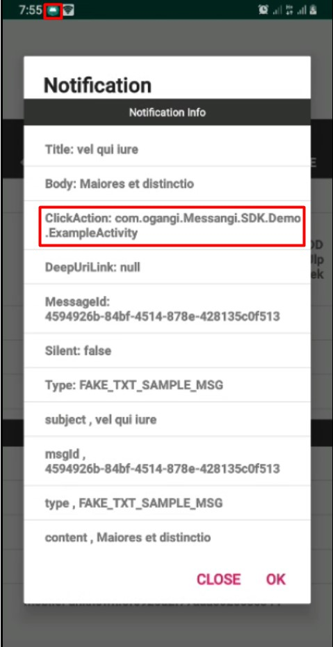

Arrival of the NP to the app that shows the detail of the same and in the upper part shows the generation of the Notification thanks to the Click-Action parameter that comes in it.

The alert is ok and the notification palette opens:

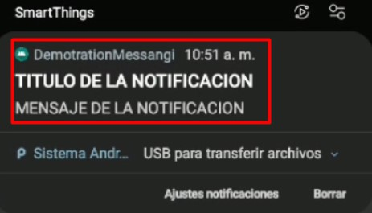

Pressing the notification opens the preselected activity and displays the notification data using the following structure:

```Java
Bundle extras=getIntent().getExtras();
        boolean enable=extras.getBoolean("enable",false);
        additionalData = new HashMap<>();
        if(extras!=null && !enable) {
            for (String key : extras.keySet()) {
               additionalData.put(key, extras.getString(key));
                messangiData.add(key + " , " + extras.getString(key));
            }
            .....
        }else{
            Serializable data = extras.getSerializable(Messaging.INTENT_EXTRA_DATA);
            messagingNotification=(MessagingNotification)data;
            additionalData=messagingNotification.getAdditionalData();
            if(additionalData!=null&& additionalData.size()>0) {
                messangiData.add("Title: " + messagingNotification.getTitle());
                messangiData.add("Body: " + messagingNotification.getBody());
                messangiData.add("ClickAction: " + messagingNotification.getClickAction());
                messangiData.add("DeepUriLink: " + messagingNotification.getDeepUriLink());
                for (Map.Entry entry : messagingNotification.getAdditionalData().entrySet()) {
                    if (!entry.getKey().equals("profile")) {
                        messangiData.add(entry.getKey() + " , " + entry.getValue());
                    }

                }
            }
        }
        .....
```

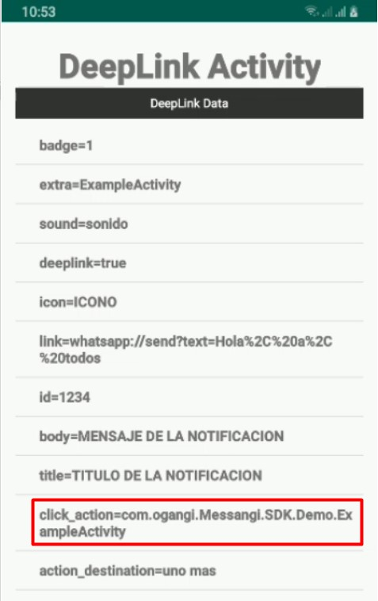

In the case of the notification that arrives with the app in the background:
The notification palette opens and you press:


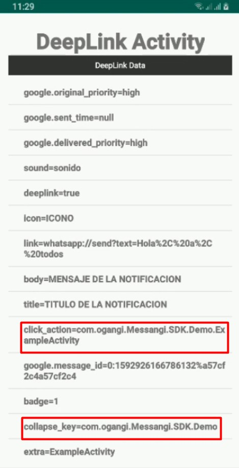

This action was performed using the native behavior of the SO. But it is important that the notification has the field: **"click_action": "com.ogangi.Messangi.SDK.Demo.ExampleActivity"** 
Defined in this way.
And the data can also be processed using:
```Java
Bundle extras=getIntent().getExtras();
        boolean enable=extras.getBoolean("enable",false);
        additionalData = new HashMap<>();
        if(extras!=null && !enable) {
            for (String key : extras.keySet()) {
               additionalData.put(key, extras.getString(key));
                messangiData.add(key + " , " + extras.getString(key));
            }
            .....
        }else{
            Serializable data = extras.getSerializable(Messaging.INTENT_EXTRA_DATA);
            messagingNotification=(MessagingNotification)data;
            additionalData=messagingNotification.getAdditionalData();
            if(additionalData!=null&& additionalData.size()>0) {
                messangiData.add("Title: " + messagingNotification.getTitle());
                messangiData.add("Body: " + messagingNotification.getBody());
                messangiData.add("ClickAction: " + messagingNotification.getClickAction());
                messangiData.add("DeepUriLink: " + messagingNotification.getDeepUriLink());
                for (Map.Entry entry : messagingNotification.getAdditionalData().entrySet()) {
                    if (!entry.getKey().equals("profile")) {
                        messangiData.add(entry.getKey() + " , " + entry.getValue());
                    }

                }
            }
        }
```

The implementation of this functionality in the demo app of this repository, in the main activity you have an **example code**.


2.	**By url schemes:**
For this, the property **"link"** sent through the push notification will be used, which has two cases:

a.	**Notification in foreground:** In this case the notification will be handled by the SDK taking the property "link" of the notification which should have a value as shown in the example:
**"link": exampleapp: // example / example? param1 = 1**, which is processed by the SDK allowing the host app to launch a navigation attempt with said Url, which if it is registered in an activity (in the file **AndroidManifest.xml**), the app will directly open that activity and handle the information sent in the notification.

b.	**Background notification:** in this case the notification will be handled by the operating system as native behavior, where the app programmer must declare the activity to open when pressing this notification, it is important to remember that the notification must bring the field **"link": exampleapp://example/example?param1=1**, for example, and the declaration of the activity by the programmer must be done in the **AndroidManifest.xml** file, for example:

```xml
        <activity android:name=".ExampleURLSchemasActivity">
            <intent-filter>
                <action android:name="android.intent.action.VIEW" />
                <category android:name="android.intent.category.DEFAULT" />
                <category android:name="android.intent.category.BROWSABLE" />
                <data
                    android:host="example"
                    android:pathPrefix="/example"
                    android:scheme="exampleapp" />
            </intent-filter>
        </activity>
```
c. **From a web browser:** in this case the flow will be managed by the operating system as native behavior, where the app programmer must declare the activity to open when pressing this DeepLink Url schemas.

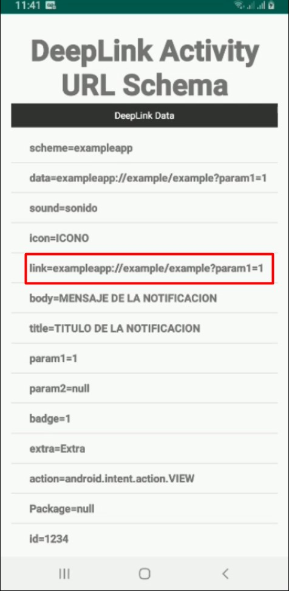

And the data can also be processed using:
in ExampleURLSchemasActivity.java
```Java
Bundle extras=getIntent().getExtras();
        boolean enable=extras.getBoolean("enable",false);
        additionalData = new HashMap<>();
        if(extras!=null && !enable) {
            for (String key : extras.keySet()) {
               additionalData.put(key, extras.getString(key));
                messangiData.add(key + " , " + extras.getString(key));
            }
            .....
        }else{
            Serializable data = extras.getSerializable(Messaging.INTENT_EXTRA_DATA);
            messagingNotification=(MessagingNotification)data;
            additionalData=messagingNotification.getAdditionalData();
            if(additionalData!=null&& additionalData.size()>0) {
                messangiData.add("Title: " + messagingNotification.getTitle());
                messangiData.add("Body: " + messagingNotification.getBody());
                messangiData.add("ClickAction: " + messagingNotification.getClickAction());
                messangiData.add("DeepUriLink: " + messagingNotification.getDeepUriLink());
                for (Map.Entry entry : messagingNotification.getAdditionalData().entrySet()) {
                    if (!entry.getKey().equals("profile")) {
                        messangiData.add(entry.getKey() + " , " + entry.getValue());
                    }

                }
            }
        }
```

The implementation of this functionality in the demo app of this repository, in the main activity you have an **example code**.


3.	**By universal links:**
For this, the property **"link"** sent through the push notification will be used, which has two cases:

a.	**Notification in foreground:** In this case the notification will be handled by the SDK taking the property "link" of the notification which should have a value as shown in the example:
**"link":http://www.plantplaces.com/colorcapture.shtml?param1=value1&param2=value2**, which is processed by the SDK allowing the host app to launch a navigation attempt with said Url, which if it is registered in an activity (in the file **AndroidManifest.xml**), the app will directly open that activity and handle the information sent in the notification.

b.	**Background notification:** in this case the notification will be handled by the operating system as native behavior, where the app programmer must declare the activity to open when pressing this notification, it is important to remember that the notification must bring the field **"link": http://www.plantplaces.com/colorcapture.shtml?param1=value1&param2=value2**, for example, and the declaration of the activity by the programmer must be done in the **AndroidManifest.xml** file, for example:

```xml
        <activity android:name=".ExampleUrlActivity">
            <intent-filter>
                <action android:name="android.intent.action.VIEW" />
                <category android:name="android.intent.category.DEFAULT" />
                <category android:name="android.intent.category.BROWSABLE" />
                <data
                    android:host="www.plantplaces.com"
                    android:pathPrefix="/colorcapture.shtml"
                    android:scheme="http" />
            </intent-filter>
        </activity>

```
c. **From a web browser:** in this case the flow will be managed by the operating system as native behavior, where the app programmer must declare the activity to open when pressing this DeepLink Url schemas.

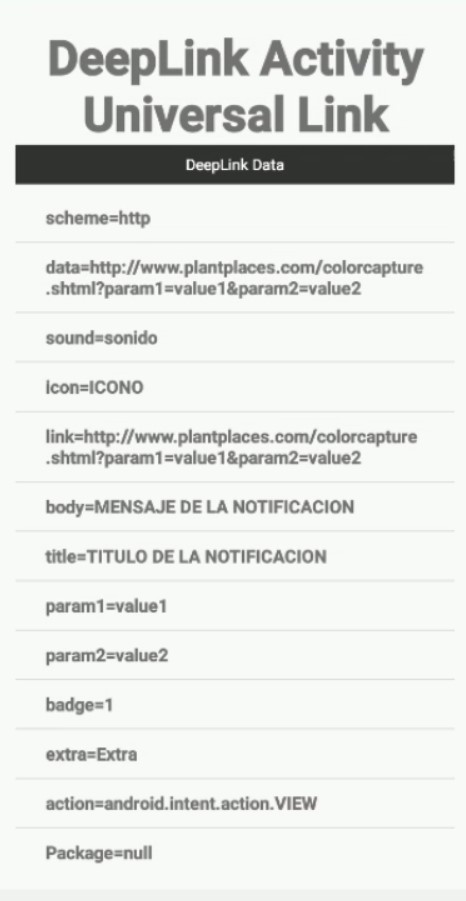

And the data can also be processed using:
in ExampleUrlActivity.java
```Java
Bundle extras=getIntent().getExtras();
        boolean enable=extras.getBoolean("enable",false);
        additionalData = new HashMap<>();
        if(extras!=null && !enable) {
            for (String key : extras.keySet()) {
               additionalData.put(key, extras.getString(key));
                messangiData.add(key + " , " + extras.getString(key));
            }
            .....
        }else{
            Serializable data = extras.getSerializable(Messaging.INTENT_EXTRA_DATA);
            messagingNotification=(MessagingNotification)data;
            additionalData=messagingNotification.getAdditionalData();
            if(additionalData!=null&& additionalData.size()>0) {
                messangiData.add("Title: " + messagingNotification.getTitle());
                messangiData.add("Body: " + messagingNotification.getBody());
                messangiData.add("ClickAction: " + messagingNotification.getClickAction());
                messangiData.add("DeepUriLink: " + messagingNotification.getDeepUriLink());
                for (Map.Entry entry : messagingNotification.getAdditionalData().entrySet()) {
                    if (!entry.getKey().equals("profile")) {
                        messangiData.add(entry.getKey() + " , " + entry.getValue());
                    }

                }
            }
        }
```

## To handle Geofence:

Create an activity (as MapActivity) in the demo app that allows you to use google maps to draw the location and geofences.

When creating an activity that handles google maps, a google_map_api.xml file is automatically created to place the google_maps_key from the google maps API.

For more detail see: https://developers.google.com/maps/premium/apikey/maps-android-apikey

```xml
<resources>
    <!--
    TODO: Before you run your application, you need a Google Maps API key.

    To get one, follow this link, follow the directions and press "Create" at the end:

    You can also add your credentials to an existing key, using these values:

    Package name:
    com.ogangi.Messangi.SDK.Demo

    Alternatively, follow the directions here:
    https://developers.google.com/maps/documentation/android/start#get-key

    Once you have your key (it starts with "AIza"), replace the "google_maps_key"
    string in this file.
    -->
    <string name="google_maps_key" templateMergeStrategy="preserve" translatable="false">API_KEY_HERE</string>
</resources>
<!--
             The API key for Google Maps-based APIs is defined as a string resource.
             (See the file "res/values/google_maps_api.xml").
             Note that the API key is linked to the encryption key used to sign the APK.
             You need a different API key for each encryption key, including the release key that is used to
             sign the APK for publishing.
             You can define the keys for the debug and release targets in src/debug/ and src/release/.
             this code is created in Manifest.xml demo app
        -->
        <meta-data
            android:name="com.google.android.geo.API_KEY"
            android:value="@string/google_maps_key" />
```
When entering the maps activity, the Geofences stored in the local database of the SDK are automatically loaded (if they are loaded).

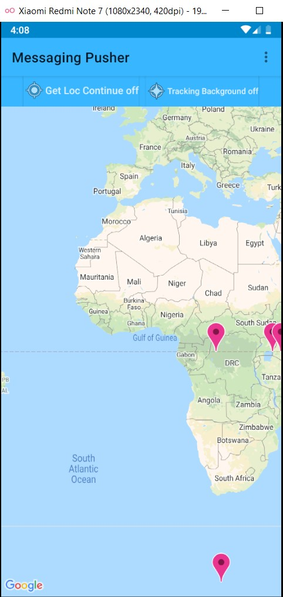

Load Geofence from data base:

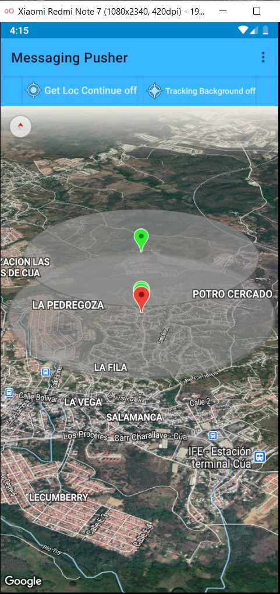

If the location of the device is within the geofence, a push notification is automatically received:

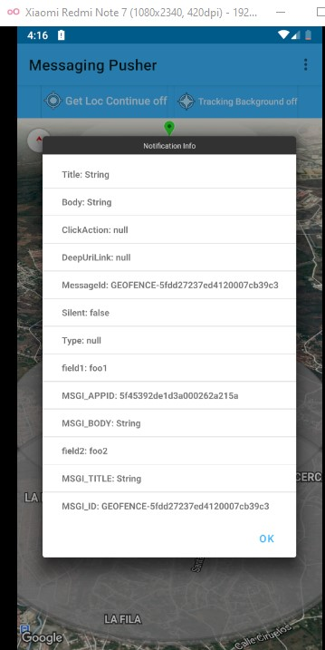

The implementation of this functionality in the demo app of this repository, in the main activity you have an **example code**.


## Author
Messaging

## License
MessagiingSDK is available under the MIT license. See the LICENSE file for more info.
