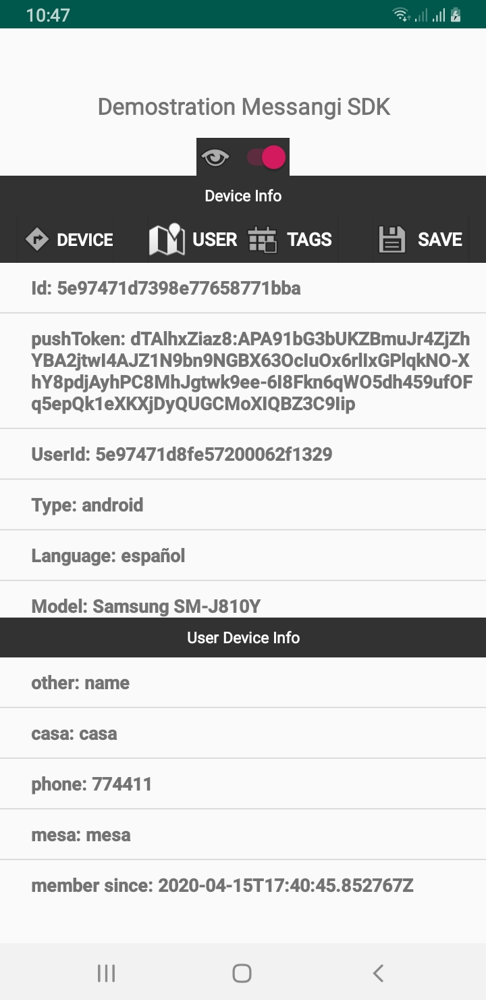

# MessagingAndroidSDK

[](https://git.messangi.com/messangi/messangi-ios-sdk)

[](https://git.messangi.com/messangi/messangi-ios-sdk)


## Description
---
It is a tool that allows you to add the following functionalities to your solution
- Send notifications through messangi services.
- Enable or disable notifications by the user.
- Register device characteristics (UUID, Type, Language, OS Version, Model).
- Associate labels to the device.
- Save customizable user information.

## Requirements
---
To use the Messangi SDK is required:
- A registered apple account in the development program.
- Follow the n steps for installation.

## Installation
----
### Step 1: Create Android Studio Project
Open Android Studio IDE and start new project you are working on.
#### Implicit Implementation
Place the "MessagiSDK" dependency in app.gradle
```Gradle 
implementation 'com.android.testdefsdknotificactionpush:sdk:1.0'
```
### 2) Configure FCM in Android Project Project
Select your project and go to the **Tools** tab, select a Firebase and open the assistant then:


1.- Select Cloud Messangin and Set up Firebase Cloud Messanging.


2.- Connect app to Firebase and create new or select Firebase project in console.


3.- Do not perform step 3 "Handle message", as the SDK will do it for you.

### 3) Put Messangi.xlm file in values project.
Put the configuration file in the values folder of the Android project

```xml
<resources>
  <string name="messangi_host" translatable="false" templateMergeStrategy="preserve"><"Url services"></string>
  <string name="messangi_app_token" translatable="false"><"Auth token"></string>
  <bool name="analytics_allowed">boolean condition</bool>
  <bool name="location_allowed">boolean condition</bool>
  <bool name="logging_allowed">boolean condition</bool>
</resources>
```
### 4) Put BroadcastReceiver in Activity project.
Put BroadcastReceiver in Activity file project, example:

```java
...
import com.ogangi.messangi.sdk.Messangi;

public class MainActivity extends AppCompatActivity{
    ...
    
           ...
        @Override
    protected void onStart() {
        super.onStart();
        LocalBroadcastManager.getInstance(this).registerReceiver(mReceiver,
                new IntentFilter(Messaging.ACTION_FETCH_DEVICE));
                .....
    }
    
```
The Receiver of the LocalBroadcastManager instances must be registered using the corresponding Intentfilte, example: Messaging.ACTION_FETCH_DEVICE 
```
    
    public void dothisForRequestUser() {
        Messaging.fetchDevice(false);
    }
    
```
Using fetchDevice device delivers the instance of a device, by internal memory, by local memory or a service.


     @Override
    protected void onDestroy() {
       LocalBroadcastManager.getInstance(this).unregisterReceiver(mReceiver);
        super.onDestroy();
    }
Unregister Receiver in actinvtiy main.

If you want to get a response from the fetch device request you should implement a BroadcastReceiver in the main activity:
 
```java
private BroadcastReceiver mReceiver=new BroadcastReceiver() {
        @Override
        public void onReceive(Context context, Intent intent) {
            boolean hasError=intent.getBooleanExtra(Messaging.INTENT_EXTRA_HAS_ERROR,true);
            
            if (!hasError ) {
                Serializable data=intent.getSerializableExtra(Messaging.INTENT_EXTRA_DATA);
                if(intent.getAction().equals(Messaging.ACTION_FETCH_DEVICE)&& data!=null){
                    messagingDevice = (MessagingDevice) data; //you can cast this for get information
                    .....
                }else if(intent.getAction().equals(Messaging.ACTION_FETCH_USER)&& data!=null){
                    messagingUser =(MessagingUser) data;
                    .......
                }else if(intent.getAction().equals(Messaging.ACTION_GET_NOTIFICATION)&& data!=null){
                    messagingNotification =(MessagingNotification) data;
                }else if(intent.getAction().equals(Messaging.ACTION_SAVE_DEVICE)&& data!=null) {
                    messagingDevice = (MessagingDevice) data; //you can cast this for get information
                   ......
                }else if(intent.getAction().equals(Messaging.ACTION_SAVE_USER)&& data!=null) {
                    messagingUser =(MessagingUser) data; //you can cast this for get information
                ......
                } 
                .....
            }else{
                Toast.makeText(getApplicationContext(),"An error occurred on action "
                        +intent.getAction(),Toast.LENGTH_LONG).show();
            }
            ......
        }
    };
   //you can see all the implementation in example app
```

## Usage
To make use of the functionalities that Messanging SDK offers, the Messaging class is available, to obtain the instance of this class you can do: 
```java
Messaging messaging=Messaging.getInstance(this);//get Instance of Messaging.. 
```
All the services offered by this library are provided by means of an instance of the Messaging class, and it can be obtained that it was indicated later.
```java
MessagingDevice messagingDevice; 
```
MessangingDevice is used for handle Device paramenter in SDK. To obtain this device instance, the SDK can provide it in three ways: by local memory, internal memory or by service. all forms use a BroadcastReceiver to get that instance. see point number 4
```java
MessagingUser messagingUser; 
```

MessagingUser is used for handle User paramenter in SDK.
To obtain this User instance, the SDK can provide it in three ways: by local memory, internal memory or by service. all forms use a BroadcastReceiver to get that instance. see point number 4

By doing this you have access to
    Method that get Device registered
    forsecallservice: It allows effective device search in three ways: by instance,
     by shared variable or by service. when forsecallservice=true, search device parameters through the service. This method use BoradcastReceiver for send Instance from SDK to Activity.See point number 4

```java
    Messaging.fetchDevice(true);
```
Method for add new Tags to Device, then you can do save and immediately it is updated in the database.

```java
     messagingDev.addTagToDevice(tags);
```
Method that make Update of paramenter Device using service, this method use BoradcastReceiver for send Instance from SDK to Activity.See point number 4.
```java
     messagingDevice.save(getApplicationContext());
```
Method for get User by Device registered from service, allows effective device search in three ways: by instance, by shared variable or by service. this method use BoradcastReceiver for send Instance from SDK to Activity.See point number 4.
When forsecallservice=true, search device parameters through the service.
```java
     Messaging.fetchUser(getApplicationContext(), true);
```
Method that make Update of User parameter using service, this method use BoradcastReceiver for send Instance from SDK to Activity.See point number 4.

```java
     messagingUser.save(getApplicationContext());;
```
Method for add Property to user, example: name, lastname, email or phone,  key : example name
     value : example Jose, then you can use messagingUser.save(getApplicationContext());
     for update User data.
     
```java
     messagingUser.save(getApplicationContext());;
```

## Example - Getting MessagingDevice
```java
...
import com.ogangi.messangi.sdk.Messangi;

public class MainActivity extends AppCompatActivity{
    ...
    @Override
    protected void onCreate(Bundle savedInstanceState) {
    super.onCreate(savedInstanceState);
        
    }
      @Override
    protected void onStart() {
        super.onStart();
       LocalBroadcastManager.getInstance(this).registerReceiver(mReceiver,
                new IntentFilter(Messaging.ACTION_FETCH_DEVICE));
      }
       ...
      @Override
    protected void onResume() {
        super.onResume();
       Messaging.fetchDevice(false);
    }
    private BroadcastReceiver mReceiver=new BroadcastReceiver() {
        @Override
        public void onReceive(Context context, Intent intent) {
            boolean hasError=intent.getBooleanExtra(Messaging.INTENT_EXTRA_HAS_ERROR,true);
            
            if (!hasError ) {
                Serializable data=intent.getSerializableExtra(Messaging.INTENT_EXTRA_DATA);
                if(intent.getAction().equals(Messaging.ACTION_FETCH_DEVICE)&& data!=null){
                    messagingDevice = (MessagingDevice) data; //you can cast this for get information
                    .....
                }else if(intent.getAction().equals(Messaging.ACTION_FETCH_USER)&& data!=null){
                    messagingUser =(MessagingUser) data;
                    .......
                
            }else{
                Toast.makeText(getApplicationContext(),"An error occurred on action "
                        +intent.getAction(),Toast.LENGTH_LONG).show();
            }
            ......
        }
    };
   //you can see all the implementation in example app
     @Override
    protected void onDestroy() {
     LocalBroadcastManager.getInstance(this).unregisterReceiver(mReceiver);
     }
   ```

## Example - Getting MessagingUser
```java
...
import com.ogangi.messangi.sdk.MessangiUserDevice;

public class MainActivity extends AppCompatActivity{
    private MessagingUser messagingUser;
    @Override
    protected void onCreate(Bundle savedInstanceState) {
    super.onCreate(savedInstanceState);
    }
    
       @Override
    protected void onStart() {
        super.onStart();
        LocalBroadcastManager.getInstance(this).registerReceiver(mReceiver,
                new IntentFilter(Messaging.ACTION_FETCH_USER));
        }
    ...
      
    protected void onGetUser() {
        Messaging.fetchUser(getApplicationContext(), true);
    }
    private BroadcastReceiver mReceiver=new BroadcastReceiver() {
        @Override
        public void onReceive(Context context, Intent intent) {
            boolean hasError=intent.getBooleanExtra(Messaging.INTENT_EXTRA_HAS_ERROR,true);
            
            if (!hasError ) {
                Serializable data=intent.getSerializableExtra(Messaging.INTENT_EXTRA_DATA);
                     .....
                }else if(intent.getAction().equals(Messaging.ACTION_FETCH_USER)&& data!=null){
                    messagingUser =(MessagingUser) data;
                    .......
                
            }else{
                Toast.makeText(getApplicationContext(),"An error occurred on action "
                        +intent.getAction(),Toast.LENGTH_LONG).show();
            }
            ......
        }
    };
   //you can see all the implementation in example app
     @Override
    protected void onDestroy() {
     LocalBroadcastManager.getInstance(this).unregisterReceiver(mReceiver);
     }
   
```
## Full implementation example:
 in MainActivity.java
```java
package com.ogangi.Messangi.SDK.Demo;
....
import androidx.annotation.RequiresApi;
import androidx.appcompat.app.AppCompatActivity;
import androidx.localbroadcastmanager.content.LocalBroadcastManager;

import com.messaging.sdk.Messaging;
import com.messaging.sdk.MessangingDevice;
import com.messaging.sdk.MessagingNotification;
import com.messaging.sdk.MessagingUser;

....

public class MainActivity extends AppCompatActivity {
    public static String CLASS_TAG=MainActivity.class.getSimpleName();
    public static String TAG="MESSANGING";
    public static final String DELETE_TAG = "DELETE_TAG";

    public Messaging messaging;
    public MessagingDevice messangingDevice;
    public MessagingUser messagingUser;
    MessagingNotification messagingNotification;
    

    @RequiresApi(api = Build.VERSION_CODES.JELLY_BEAN_MR2)
    @Override
    protected void onCreate(Bundle savedInstanceState) {
        super.onCreate(savedInstanceState);
        getWindow().requestFeature(Window.FEATURE_ACTION_BAR);

        getSupportActionBar().hide();
        setContentView(R.layout.activity_main);
        messaging = Messaging.getInstance(this);
        messaging.getExternalId());// get external ID using Sdk.

        device.setOnClickListener(new View.OnClickListener() {
            @Override
            public void onClick(View v) {
               ...
                Messaging.fetchDevice(true);
                Messaging.fetchUser(getApplicationContext(), true);
                
            }
        });

       save.setOnClickListener(new View.OnClickListener() {
            @Override
            public void onClick(View v) {
                if (messangingDevice.getTags().size() > 0) {
                    progressBar.setVisibility(View.VISIBLE);
                    messagingDevice.save(getApplicationContext());//save parameter in backend using service.
                } else {
                    Toast.makeText(getApplicationContext(), "Nothing to save", Toast.LENGTH_LONG).show();
                }
            }
        });

        //for handle notification from background
        Bundle extras=getIntent().getExtras();
        messagingNotification =new MessagingNotification(extras,getApplicationContext());

    }

    @Override
    protected void onStart() {
        ....
        LocalBroadcastManager.getInstance(this).registerReceiver(mReceiver,
                new IntentFilter(Messaging.ACTION_FETCH_DEVICE));
        LocalBroadcastManager.getInstance(this).registerReceiver(mReceiver,
                new IntentFilter(Messaging.ACTION_FETCH_USER));
        LocalBroadcastManager.getInstance(this).registerReceiver(mReceiver,
                new IntentFilter(Messaging.ACTION_GET_NOTIFICATION));
        LocalBroadcastManager.getInstance(this).registerReceiver(mReceiver,
                new IntentFilter(Messaging.ACTION_SAVE_DEVICE));
        LocalBroadcastManager.getInstance(this).registerReceiver(mReceiver,
                new IntentFilter(Messaging.ACTION_REGISTER_DEVICE));
        LocalBroadcastManager.getInstance(this).registerReceiver(mReceiver,
                new IntentFilter(Messaging.ACTION_SAVE_USER));
    }

    @SuppressLint("SetTextI18n")
    @Override
    protected void onResume() {
       .....
       Messaging.fetchDevice(false);//get device parameter
       }
    
    private BroadcastReceiver mReceiver=new BroadcastReceiver() {
        @Override
        public void onReceive(Context context, Intent intent) {
            nameMethod=new Object(){}.getClass().getEnclosingMethod().getName();

            boolean hasError=intent.getBooleanExtra(Messaging.INTENT_EXTRA_HAS_ERROR,true);
            Log.d(TAG,"ERROR: "+CLASS_TAG+": "+nameMethod+": Has error:  "+ hasError);
            if (!hasError ) {
                Serializable data=intent.getSerializableExtra(Messaging.INTENT_EXTRA_DATA);
                if(intent.getAction().equals(Messaging.ACTION_FETCH_DEVICE)&& data!=null){
                    messagingDevice = (MessagingDevice) data; //you can cast this for get information

                    showdevice(messagingDevice);

                }else if(intent.getAction().equals(Messaging.ACTION_FETCH_USER)&& data!=null){
                    messagingUser =(MessagingUser) data;
                    shwUser(messagingUser);

                }else if(intent.getAction().equals(Messaging.ACTION_GET_NOTIFICATION)&& data!=null){
                    messagingNotification =(MessagingNotification) data;
                    showAlertNotificaction(messagingNotification);

                }else if(intent.getAction().equals(Messaging.ACTION_SAVE_DEVICE)&& data!=null) {
                    messagingDevice = (MessagingDevice) data; //you can cast this for get information
                    //for condition of save (user or device);
                    Toast.makeText(getApplicationContext(),intent.getAction(),Toast.LENGTH_LONG).show();
                    showdevice(messagingDevice);
                }else if(intent.getAction().equals(Messaging.ACTION_SAVE_USER)&& data!=null) {
                    messagingUser =(MessagingUser) data; //you can cast this for get information
                    //for condition of save (user or device);
                    Toast.makeText(getApplicationContext(),intent.getAction(),Toast.LENGTH_LONG).show();
                    shwUser(messagingUser);
                } else {
                    Toast.makeText(getApplicationContext(),intent.getAction(),Toast.LENGTH_LONG).show();
                }

            }else{

                Toast.makeText(getApplicationContext(),"An error occurred on action "
                        +intent.getAction(),Toast.LENGTH_LONG).show();
                if(progressBar.isShown()){
                    progressBar.setVisibility(View.GONE);
                }

            }
            if(progressBar.isShown()){
                progressBar.setVisibility(View.GONE);
            }
        }
    };

    @Override
    protected void onDestroy() {
        LocalBroadcastManager.getInstance(this).unregisterReceiver(mReceiver);
        }
}
```
For handle Notification in Background you must use this code in Activity:
```java
        //for handle notification from background
        Bundle extras=getIntent().getExtras();
        messagingNotification =new MessagingNotification(extras,getApplicationContext());
```
## more detail see example app (demoApp)

 if you want handle from app the notification you can create class in app project named CustomMessangiService, example:

```java
package com.ogangi.Messangi.SDK.Demo;

import android.util.Log;

import com.google.firebase.messaging.RemoteMessage;
import com.messaging.sdk.MessagingFirebaseService;
import com.messaging.sdk.MessagingNotification;

public class CustomMessangiService extends MessagingFirebaseService {

  ....
    @Override
    public void onNewToken(String s) {
        super.onNewToken(s);
    }

    @Override
    public void onMessageReceived(RemoteMessage remoteMessage) {
        //example to custom
        MessagingNotification messagingNotification = new MessagingNotification(remoteMessage, this);
        messagingNotification.getAdditionalData();
    }
}


```
 It is important to use super.onNewToken(s) (heredity), it is necessary for the proper functioning of the sdk, for this custom class, and you will can receive message using method onMessageReceived.
 **Remember** if you want to use **CustomMessangiService**, please declare service in Manifest.xml of app project, example:
```xml
<?xml version="1.0" encoding="utf-8"?>
<manifest xmlns:android="http://schemas.android.com/apk/res/android"
    xmlns:tools="http://schemas.android.com/tools"
    package="com.ogangi.Messangi.SDK.Demo">

    <application
        .....
        <activity 
        </activity>
        <service
                    android:name=".CustomMessangiService"
                    android:permission="com.google.android.c2dm.permission.SEND">
                    <intent-filter>
                        <action android:name="com.google.firebase.MESSAGING_EVENT" />
                        <action android:name="com.google.android.c2dm.intent.RECEIVE" />
                    </intent-filter>
        </service>
    </application>
</manifest>
```

## To use DeepLink:
1.	By Payload:
For this, the property "click_action" sent through the push notification will be used, which has two cases:

a.	Notification in foreground: this case the notification will be handled by the SDK taking the property "click_action" of the notification which should have a value as shown in the example: "click_action": "com.ogangi.Messangi.SDK. Demo.ExampleActivity ", which is processed by the SDK creating an icon in the notification tray that when clicked opens the activity selected or described in the action.

b.	Background notification: in this case the notification will be handled by the operating system as native behavior, where the app programmer must declare the activity to open when pressing this notification, it is important to remember that the notification must bring the field " click_action ":" com.ogangi.Messangi.SDK.Demo.ExampleActivity ", for example, and the declaration of the activity by the programmer must be done in the AndroidManifest.xml file, for example:
```xml
        <activity android: name = ". ExampleActivity">
             <intent-filter>
             <action android: name = "com.ogangi.Messangi.SDK.Demo.ExampleActivity" />
             <category android: name = "android.intent.category.DEFAULT" />
             </intent-filter>
        </activity>
```
In MainActivity of the demo app.
In foreground and notification is sent.



Arrival of the NP to the app that shows the detail of the same and in the upper part shows the generation of the Notification thanks to the Click-Action parameter that comes in it.

The alert is ok and the notification palette opens:


Pressing the notification opens the preselected activity and displays the notification data using the following structure:

```Java
Bundle extras=getIntent().getExtras();
        if(extras!=null) {
            for (String key : extras.keySet()) {
            Key =  key  
            Value=extras.getString(key)
            }
        } 
```


In the case of the notification that arrives with the app in the background:
The notification palette opens and you press:


This action was performed using the native behavior of the SO. But it is important that the notification has the field: "click_action": "com.ogangi.Messangi.SDK.Demo.ExampleActivity" 
Defined in this way.
And the data can also be processed using:
```Java
Bundle extras=getIntent().getExtras();
        if(extras!=null) {
            for (String key : extras.keySet()) {
            Key =  key  
            Value=extras.getString(key)
            }
        } 
```


## Author
Messaging

## License
MessagiingSDK is available under the MIT license. See the LICENSE file for more info.
